# Основы ИИ и нейронных сетей

## Определения

**ИИ** - способность искусственно организованных систем брать на себя функции, принадлежащие объектам
естественного происхождения(человеку, животным, социальным системам и т.д.) и использовать принципы и механизмы для
решения различных задач.

**Искусственная нейросеть** - математический аппарат, основанный на аналогах с функционированием ЦНС и
предназначенный для широкого круга математических, творческих, лингвистических и др. задач.

**Архитектура нейросети** - сочетание принципов организации и функционирования нейр. сети, отдельных
иск-х нейронов, алгоритмов и расчетн. отношений.

---

## Решаемые задачи

- Нахождение значения функции по заданным аргументам на основе данных реального или вычислительного
  эксперимента.
- Задачи интерполирования и аппроксимации данных.
- Задачи кластеризации.
- Задачи прогнозирования временных рядов.
- Распознавание и ассоциация образов.
- Классификация и идентификация образов.

---

## Основные элементы нейронных сетей

**Искусственный нейрон** - элементарная структурная единица нейронной сети, выполняющая функцию
обработки сигналов, поступающих с сенсоров или других нейронов и представления результата в форме
выходного значения.

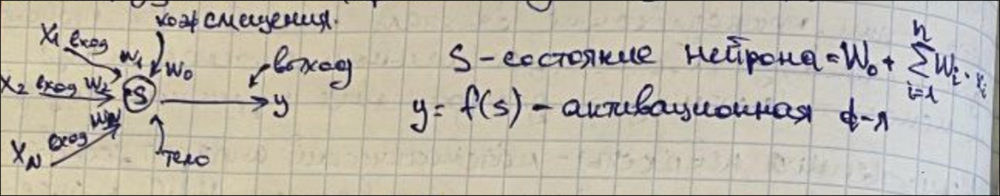

**Структура нейр. сети** - определяется количественным составом входных и выходных переменных, способом
группирования нейронов в сети, способом организации связи между нейронами и слоями.

**Обучение нейронной сети** - процедура точного или итерационного расчета всех весовых коэффициентов.

**Эпоха обучения** - цикл однократного применения(как правило в случайном порядке) всех примеров
обучающей выборки для коррекции весовых коэффициентов.

---

## Виды функций активации

1. **Гистерезис** - монотонное возрастание и убывание, насыщение вблизи границ и max по абсолютной
   величине скорость изменения функции в центре области определения.

2. **Импульс** - характеризуется наличием максимума(в искл. случае минимума) функции в центре и насыщение
   вблизи границ области определения.

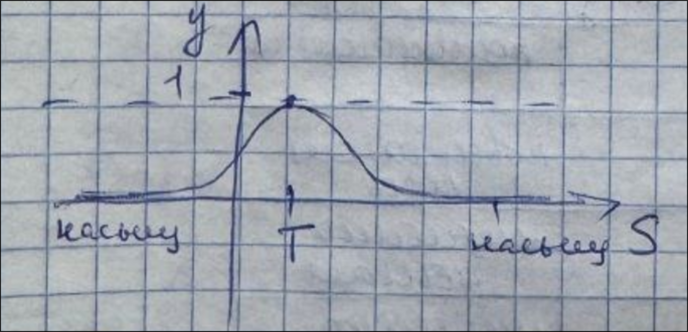

3. **Порог** - характеризуется мгновенным изменением выходного значения функции при достижении заданного
   порога.

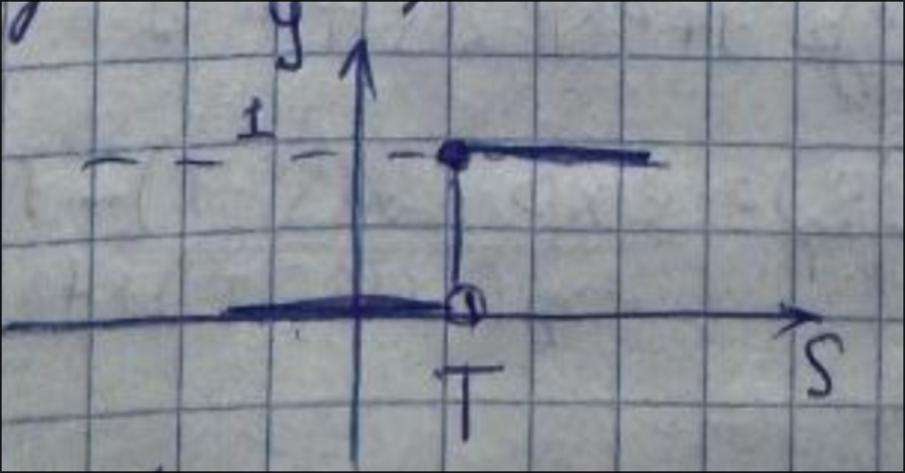

---

## Виды гистерезиса

1. Сигмоидная логистическая функция с насыщением σ. область допустимых значений с одной стороны
   стремится к 0 с другой к 1.

2. Линейный порог

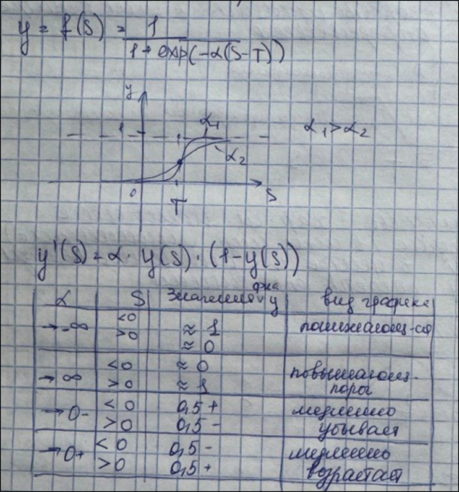

3. Гиперболический тангенс

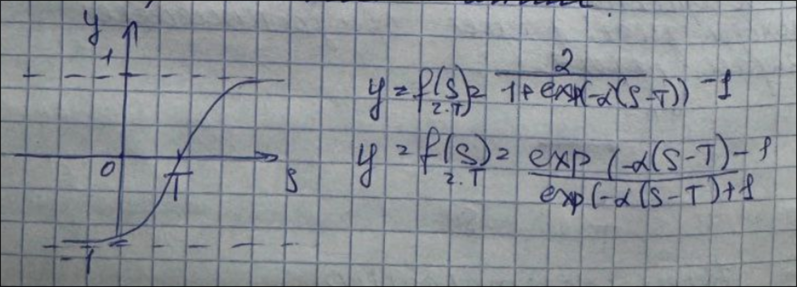

---

## Определения

**Слой нейронов** - группа нейронов, соединенных связями 1 уровня с нейронами других групп, входами сети
или друг с другом.

**Выходной слой** - слой нейронов, выходы которого являются выходами всей сети и нейросетевой модели.

**Скрытые слои** - все слои, кроме выходного.

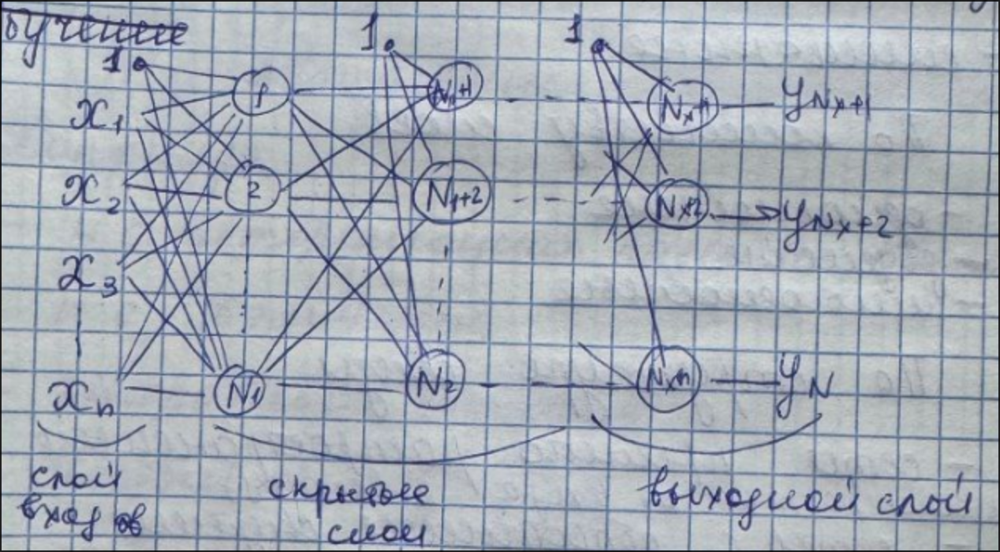

---

## Классификация

1. По способу обучения:

    - обучение с учителем.
    - обучение без учителя.
    - с подкреплением(нейросеть обучается заданной линией поведения во взаимодействиисо внешней средой).

2. По типу алгоритмов:

    - итерационные алгоритмы.
    - точный алгоритм(веса рассчитываются однократно, по правилу и критерию, заложенному в алгоритм).
    - алгоритм с дообучением.

3. По области допустимых значений входных и выходных сигналов:

    - аналоговые сигналы(бесконечное множество в ограниченном пределе).
    - бинарные сигналы.
    - смешанные.

4. По количеству слоев:

    - однослойные.
    - двухслойные.
    - многослойные.

5. По структуре связи:

    - сети прямого распространения(сигнал распространяется от входа к выходу).
    - сети с обратными связями(рекуррентные), сигналы отдельных нейронов или слоев возвращаются из входов
того же или предыдущих слоев.

6. По режиму изменения состояния нейрона:

    - синхронные(в определенный момент времени изменяется состояние всех нейронов сети или слоя).
    - асинхронные.

7. По форме исполнения нейр. сети:

    - аппаратные.
    - программные.

8. По архитектуре сети:

    - однослойные и многослойные перцептроны.
    - нейронная сеть радиально-базисных функций.
    - нейронная сеть Кохонена.
    - н.с. адаптивного резонанса.
    - н.с. автоассоциативной памяти Хопфилда.
    - генеративно-состязательные.
    - сверточные
    - сети-трансформеры.

---

## Этапы жизненного цикла:

1. Постановка заданий и выбор архитектуры.
2. Определение количественного и качественного составов входов и выходов.
3. формирование исходной выборки данных.

## Требования

1. Соответствие выборки структуре нейронной сети.
2. Уникальность примеров.
3. Непротиворечивость выбора.
4. Репрезентативность - наличие широкого и более-менее распределенного спектра входных данных и всех их
   возможных комбинаций.

---

# Информация из методы

## Определения

**Искусственные нейронные сети** – это математический аппарат, основанный на аналогиях с функционированием центральной нервной системы и предназначенный для решения широкого круга задач, таких, как распознавание образов, классификация, кластеризация и аппроксимация данных, прогнозирование временных рядов, адаптивное управление и многих других. Круг решаемых задач может быть различен для разных архитектур.

**Архитектура нейронной сети** – совокупность, объединяющая принципы организации и функционирования нейронной сети и отдельных искусственных нейронов, алгоритмы и расчетные соотношения для ее обучения.

**Искусственный нейрон** – это элементарная структурная единица искусственной нейронной сети, выполняющая функции по обработке входных сигналов xi, поступающих с других нейронов, и представлению результата в форме выходного значения. В общем случае, входные сигналы подвергаются в теле нейрона преобразованию, зачастую нелинейному, с участием **весовых (синаптических) коэффициентов** wi, характеризующих значимость каждой связи, и функции активации. При необходимости для более качественного обучения в некоторых нейросетевых архитектурах вектор синаптических коэффициентов дополняется **коэффициентом смещения** w0 – весом фиктивного единичного входа.
Структура искусственного нейрона схематично показана на рис. 2.1.

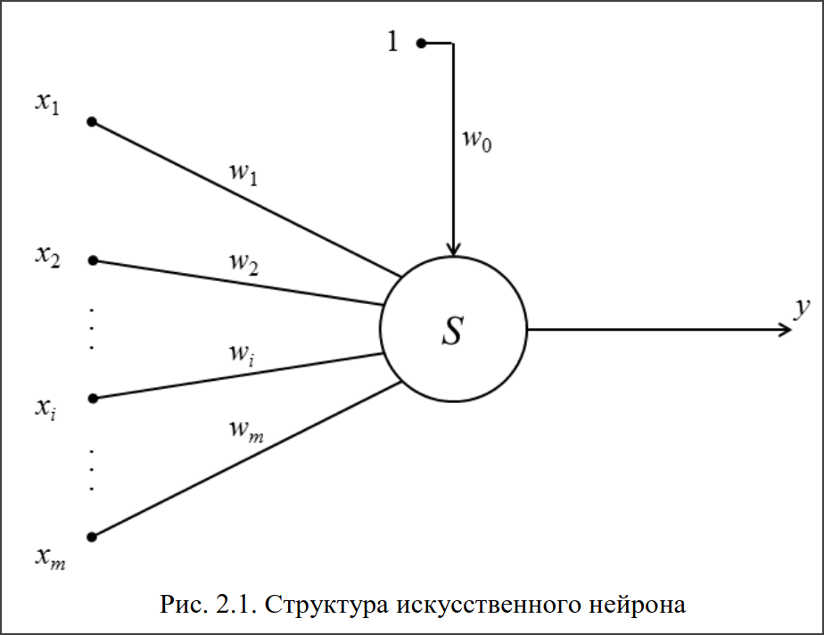

**Состояние нейрона** s определяется как взвешенная с помощью синаптических коэффициентов сумма его входных значений:

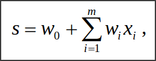

где m – количество входных сигналов нейрона.

**Функция активации** преобразует состояние нейрона в значение в форме и масштабе выходного сигнала:

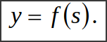

В большинстве случаев для активации нейронов используются два типа функций: гистерезиса (насыщения) и импульсные. Выбор активационной функции выходных нейронов должен определяться, в первую очередь, характером описываемых ими зависимостей. Для скрытых нейронов вид и настройки активационных функций в большинстве случаев могут совпадать.

Пример схемы двухслойной искусственной нейронной сети с M входами, m1 нейронами единственного скрытого слоя и K выходами представлен на рис. 2.2.

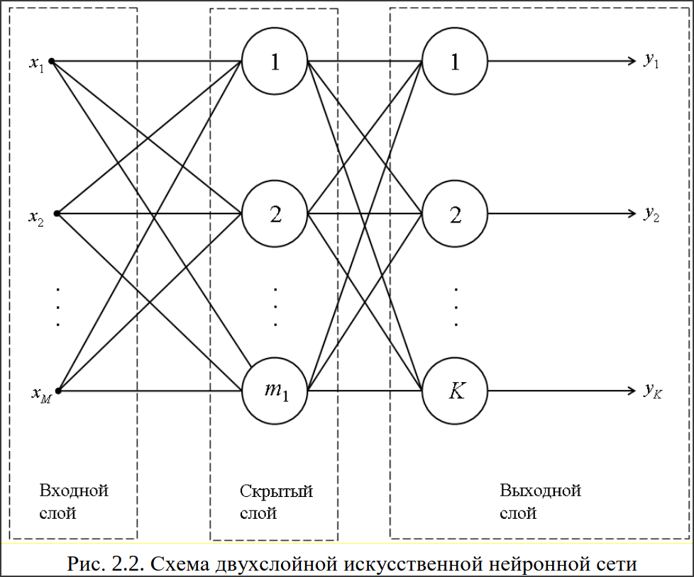

## Активационные функции и их свойства

К активационным функциям типа **гистерезиса** относятся:

- понижающегося единичного скачка (рис. 4.1, а):

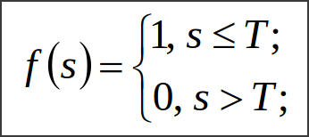

- повышающегося единичного скачка (рис. 4.1, б):

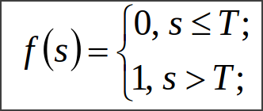

- линейная пороговая (рис. 4.1, в, г):

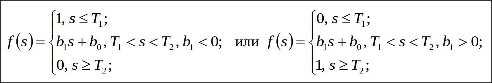

- сигмоидная логистическая (рис. 4.1, д):

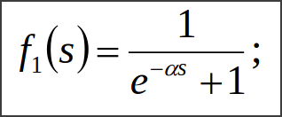

- сигмоидная – гиперболический тангенс (рис. 4.1, е):

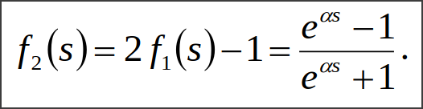

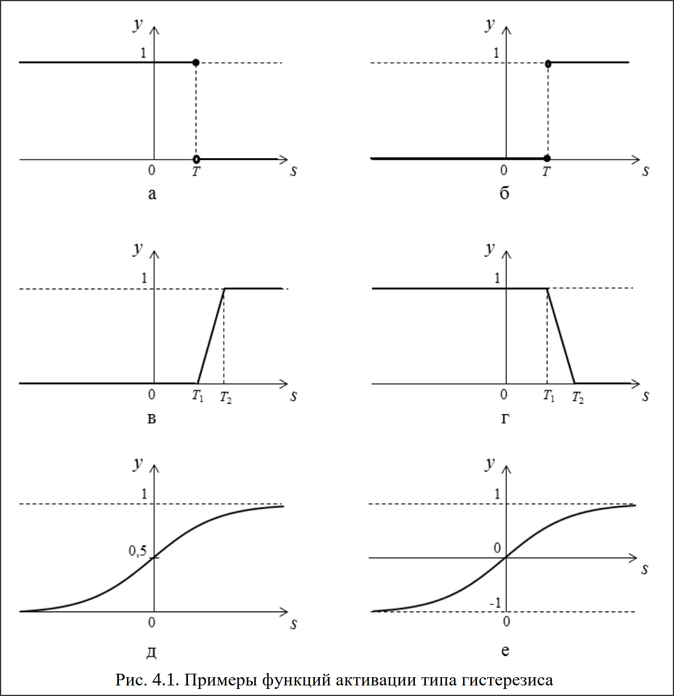

Варьируя параметр насыщения α логистической функции или гиперболического тангенса, можно добиться изменения вида их графика. В предельных значениях, близких по абсолютному значению к 0 или к бесконечности, графики обеих функций приближаются к форме горизонтальной прямой на уровне середины интервала изменения нормированной переменной или мгновенного скачка (таблица).

**Свойства сигмоидных функций**:

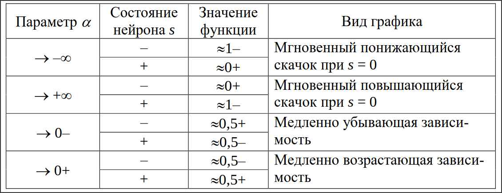

Еще одно очень важное свойство сигмоидных функций – возможность точного расчета значений их производных только на основе численных значений самих функций. Данное свойство выгодно используется во
многих алгоритмах обучения нейронных сетей.
В соответствии с описанным свойством для сигмоидной логистической функции производную в точке s можно рассчитать по соотношению:

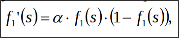

а для функции гиперболического тангенса:

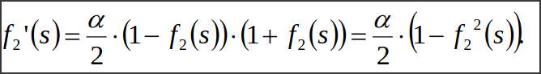

В качестве функции импульсного типа обычно используется функция Гаусса (рис. 4.2, а):

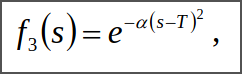

где α > 0, причем, чем меньше значение α, тем более широкий импульс на графике функции; T – координата вертикальной оси симметрии функции Гаусса. В пределе при α = 0 функция вырождается в горизонтальную прямую на уровне 1.

Производная данной функции в точке s также легко может быть рассчитана по ее выходному значению:

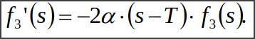

Кроме того, в качестве функции импульсного типа может быть использована кусочно-линейная П-зависимость (рис. 4.2, б):

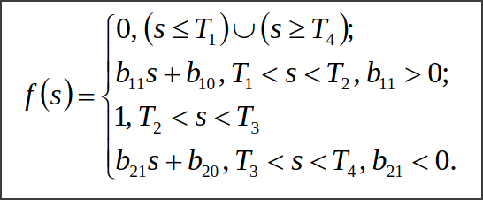

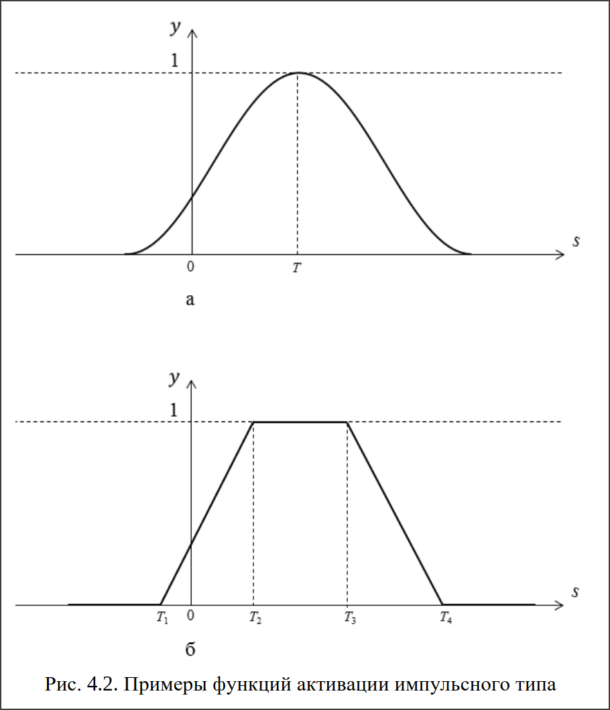

---

## Этапы жизненного цикла нейронной сети

1. Постановка задачи и выбор архитектуры – Определение целей, причин применения нейросетевого моделирования и выбор соответствующей архитектуры.
2. Определение входов и выходов – Установление качественного и количественного состава переменных на основе задачи.
3. Формирование выборки данных – Сбор данных из экспериментов или вычислений для обучения модели.
4. Предварительная обработка и нормализация – Приведение данных к формату, подходящему для обучения сети.
5. Разделение выборки – Деление данных на обучающую и тестовую подвыборки.
6. Определение структуры сети – Выбор количества слоев и нейронов в каждом из них.
7. Настройка параметров обучения – Определение активационных функций, алгоритмов и критериев завершения обучения.
8. Обучение – Настройка весов сети путем многократного предъявления обучающих примеров.
9. Оптимизация (контрастирование) – Исключение незначимых весов для уменьшения вычислительных затрат.
10. Тестирование – Проверка точности сети на тестовых данных.
11. Практическое использование – Применение обученной сети для прогнозов и решений.
12. Дообучение – Адаптация сети на основе новых данных в процессе эксплуатации.

