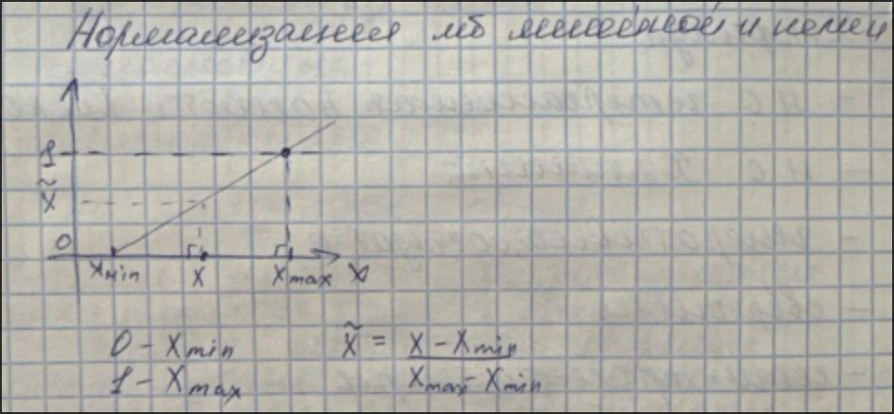
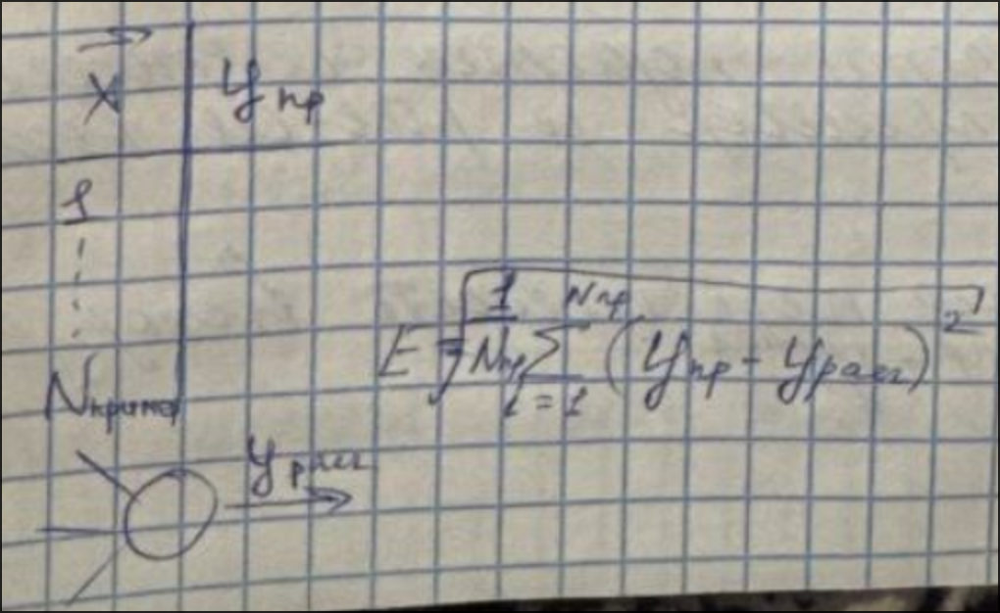
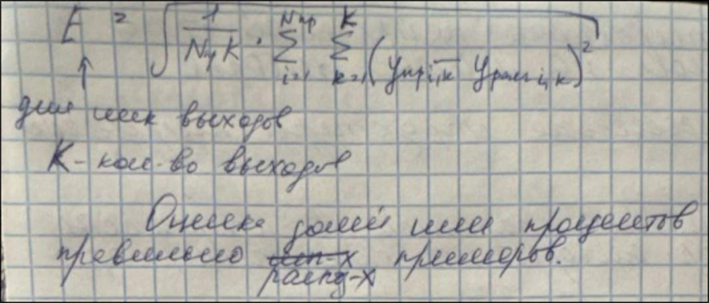
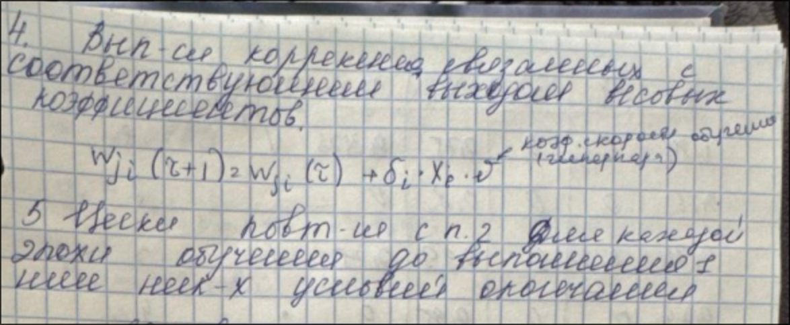
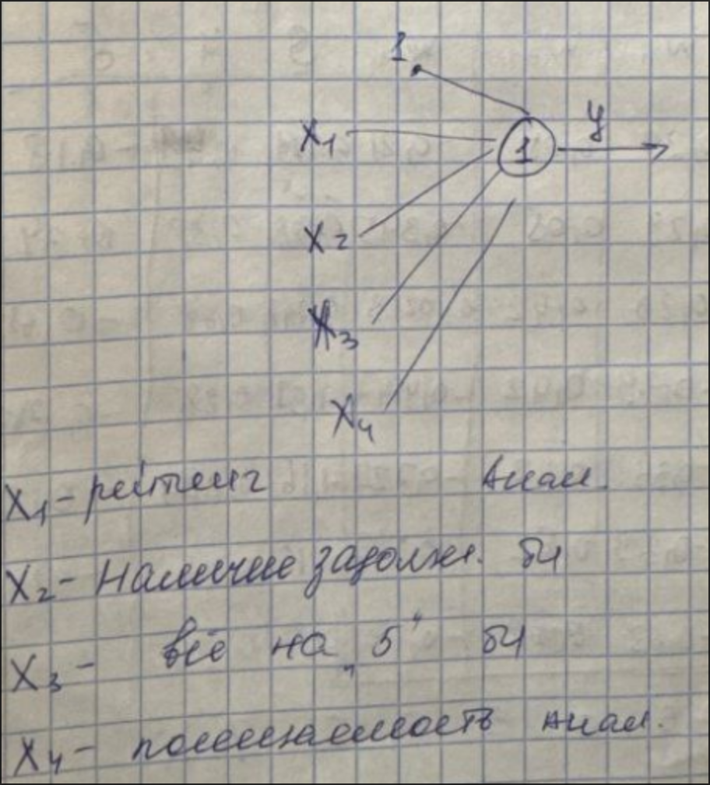
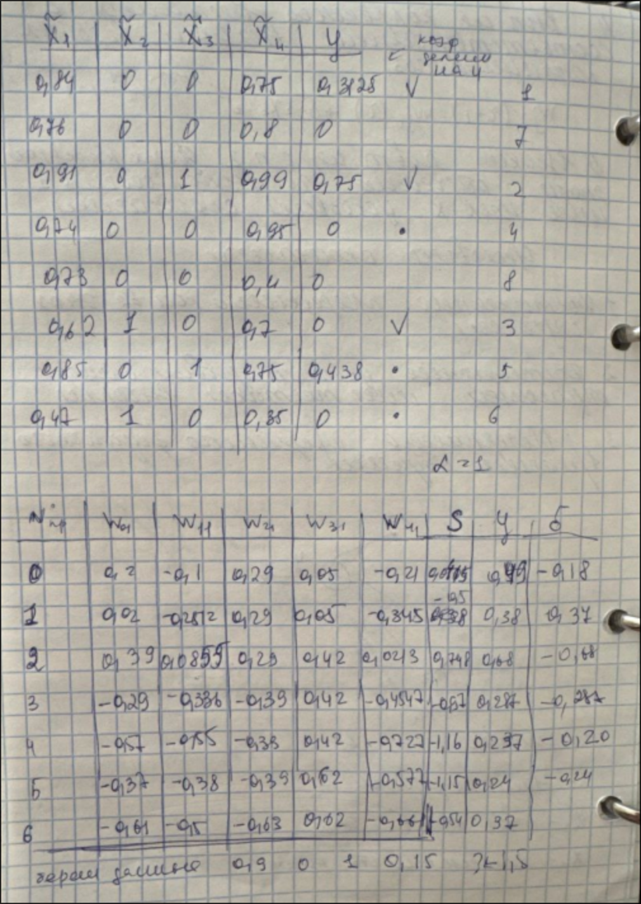
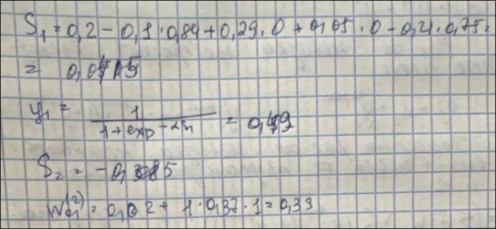
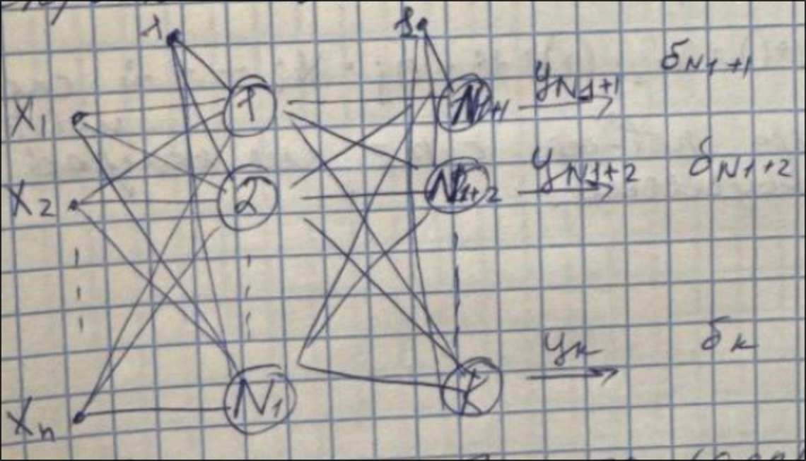
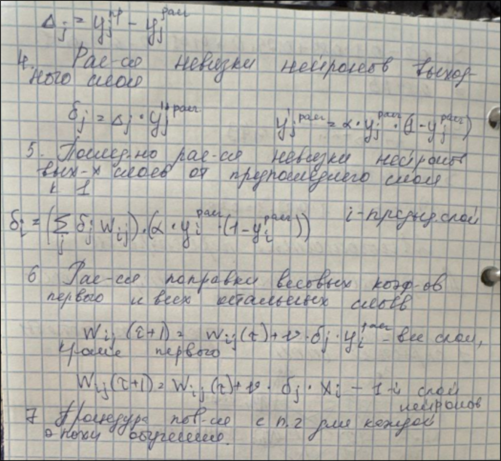

# Предварительная обработка и нормализация

---

## Деление исходной выборки на обучающую и тестовую

* Если выборка малого объема, как правило, для обучения и тестирования используются все 100% исходной
  выборки.
* Если выборка среднего объема(100-500 примеров), она делится на обучающую и тестовую в соотношении 9 :
  1.
* Если выборка большого объема(>500) соотношение 8 : 2.

---

## Тестирование нейронной сети, обучаемой на малой выборке

* Определение структуры нейронной сети.
* Настройка параметров нейронной сети и выбор алгоритма(определение гиперпараметров).
    - Выбор активационных функций и их параметров.
* Обучение нейронной сети.
* Контрастирование нейронной сети.

* Тестирование нейронной сети.
* Практическое использование нейронной сети.
* Дообучение нейронной сети.

---

## Оценка качества нейросетевых моделей

* Оценка по ошибкам обучения и тестирования.

---

## Однослойные перцептроны

**Перцептрон** - нейр. сеть прямого распространения, использующая в качестве активационной функции
сигмоидную логистическую функцию с насыщением.

---

## Условие окончания

1. Достижение предельного количества эпох обучения.
2. Достижение достаточного условия ошибки обучающей или тестовой выборки.
3. Исчерпание предельного физического времени обучения.

---

## Пример

---

## Многослойные перцептроны

Многослойный перцептрон содержит хотя бы 1 скрытый слой.

### Алгоритм обратного распространения ошибки

