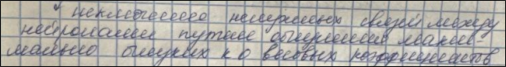
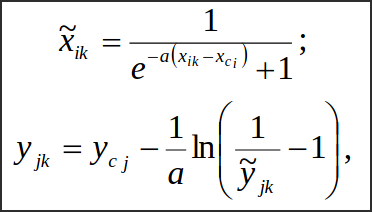
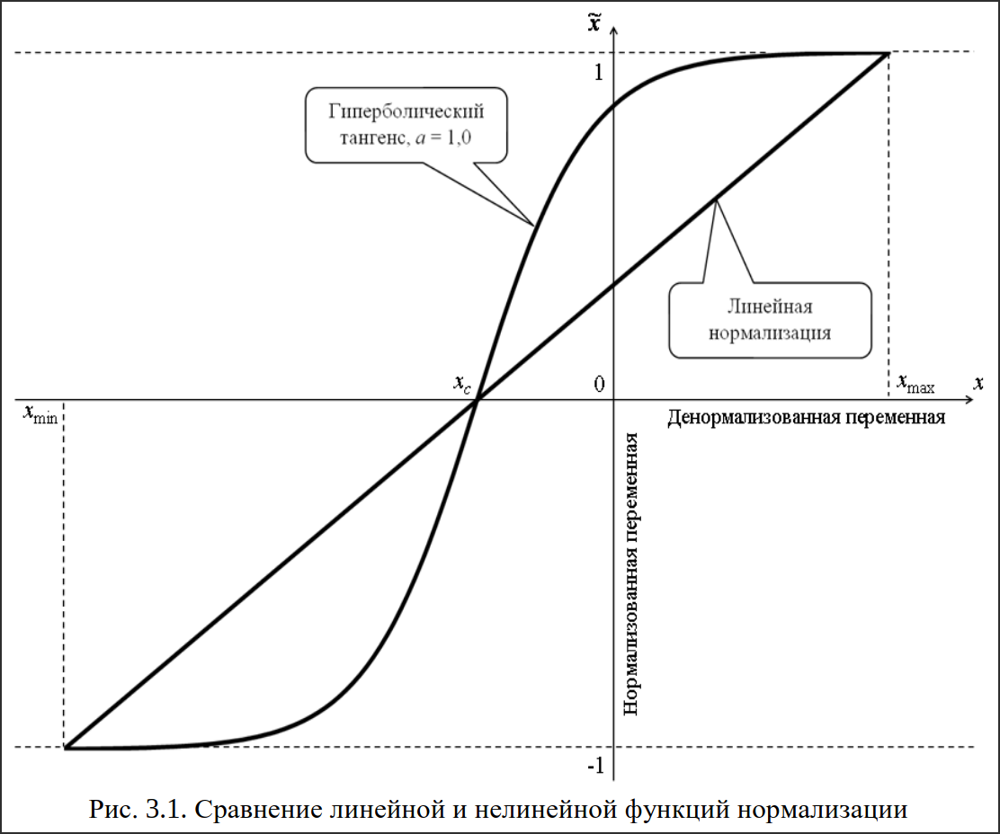

# Предварительная обработка и нормализация

---

## Деление исходной выборки на обучающую и тестовую

* Если выборка малого объема, как правило, для обучения и тестирования используются все 100% исходной
  выборки.
* Если выборка среднего объема(100-500 примеров), она делится на обучающую и тестовую в соотношении 9 :
  1.
* Если выборка большого объема(>500) соотношение 8 : 2.

---

## Тестирование нейронной сети, обучаемой на малой выборке

* Определение структуры нейронной сети.
* Настройка параметров нейронной сети и выбор алгоритма(определение гиперпараметров).
    - Выбор активационных функций и их параметров.
* Обучение нейронной сети.
* Контрастирование нейронной сети.

* Тестирование нейронной сети.
* Практическое использование нейронной сети.
* Дообучение нейронной сети.

---

## Оценка качества нейросетевых моделей

* Оценка по ошибкам обучения и тестирования.

---

## Однослойные перцептроны

**Перцептрон** - нейр. сеть прямого распространения, использующая в качестве активационной функции
сигмоидную логистическую функцию с насыщением.

---

## Условие окончания

1. Достижение предельного количества эпох обучения.
2. Достижение достаточного условия ошибки обучающей или тестовой выборки.
3. Исчерпание предельного физического времени обучения.

---

## Пример

---

## Многослойные перцептроны

Многослойный перцептрон содержит хотя бы 1 скрытый слой.

### Алгоритм обратного распространения ошибки

---

# Информация из методы

## Способы нормализации переменных

Наиболее распространенный способ нормализации входных и выходных переменных – **линейная нормализация**.

Примем следующие обозначения:

Если обучающая выборка не содержит примеров с потенциально возможными меньшими или большими выходными значениями, можно задаться шириной коридора экстраполяции ψ для левой, правой или обеих границ в долях от длины всего первоначального интервала изменения переменной, обычно не более 10 % от нее. В этом случае происходит переход от фактических границ из обучающей выборки к гипотетическим:

Один из способов **нелинейной нормализации** – с использованием сигмоидной логистической функции или гиперболического тангенса. Переход от традиционных единиц измерения к нормализованным и обратно в данном случае осуществляется следующим образом:

- при нормализации и денормализации в пределах [0, 1]:

где xc_i, yc_j – центры нормализуемых интервалов изменения входной и выходной переменных:

- при нормализации и денормализации в пределах [–1, 1]:

Параметр α влияет на степень нелинейности изменения переменной в нормализуемом интервале. Кроме того, при использовании значений α < 0,5 нет необходимости дополнительно задаваться шириной коридора экстраполяции.

Рассмотрим в сравнении методы линейной и нелинейной нормализации.На рис. 3.1 приведены графики нормализации входной переменной для пределов [–1; 1]. Для нелинейной нормализации с использованием функции гиперболического тангенса принято значение параметра α = 1,0. Следует отметить, что совпадение нормализованного значения в обоих случаях имеет место лишь в точке, соответствующей центру нормализуемого интервала.

На рис. 3.2 показаны случаи нелинейной нормализации в пределах [0; 1] с использованием функции гиперболического тангенса с параметрами α, равными, соответственно, 0,3, 0,5, 1,0. Очевидно, что чем меньше значение параметра a, тем более полого выглядит нормализованная зависимость и больше ширина коридора экстраполяции

---

## Однослойные перцептроны

В современном понимании **перцептроны** представляют собой однослойные или многослойные искусственные нейронные сети прямого распространения с бинарными или аналоговыми выходными сигналами, обучающиеся с учителем. Они хорошо подходят для решения нескольких типов задач: аппроксимации данных, прогнозирования состояния на основе временного ряда, распознавания образов и классификации, а также могут быть использованы в других задачах сами по себе или совместно с другими методами моделирования.

На рис. 8.1 представлена структура однослойного перцептрона с M входами и K выходами. Очевидно, что каждый выход соответствует своему нейрону единственного слоя. Кроме того, ясно, что сложность структуры однослойной сети не может варьироваться ввиду отсутствия скрытых слоев нейронов.

Количество весовых коэффициентов Nw, настраиваемых в процессе обучения, рассчитывается следующим образом:

Однослойные перцептроны обучаются на основе итерационного метода Уидроу–Хоффа, иначе называемого дельта-правилом. Алгоритм данного метода следующий:

1. Весовые коэффициенты однослойного перцептрона выбранной структуры инициализируются небольшими по абсолютной величине (не более M^–1) случайными значениями.

2. На входы перцептрона подается входной вектор одного из примеров обучающей выборки. Производится прямое распространение сигналов по сети с расчетом значений выходных переменныхр .
