# Лекция 3

## Пример

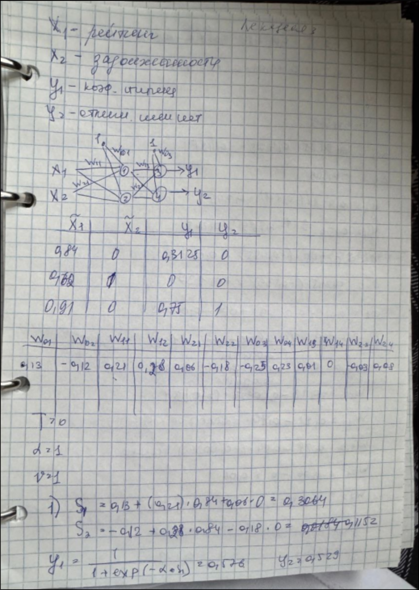
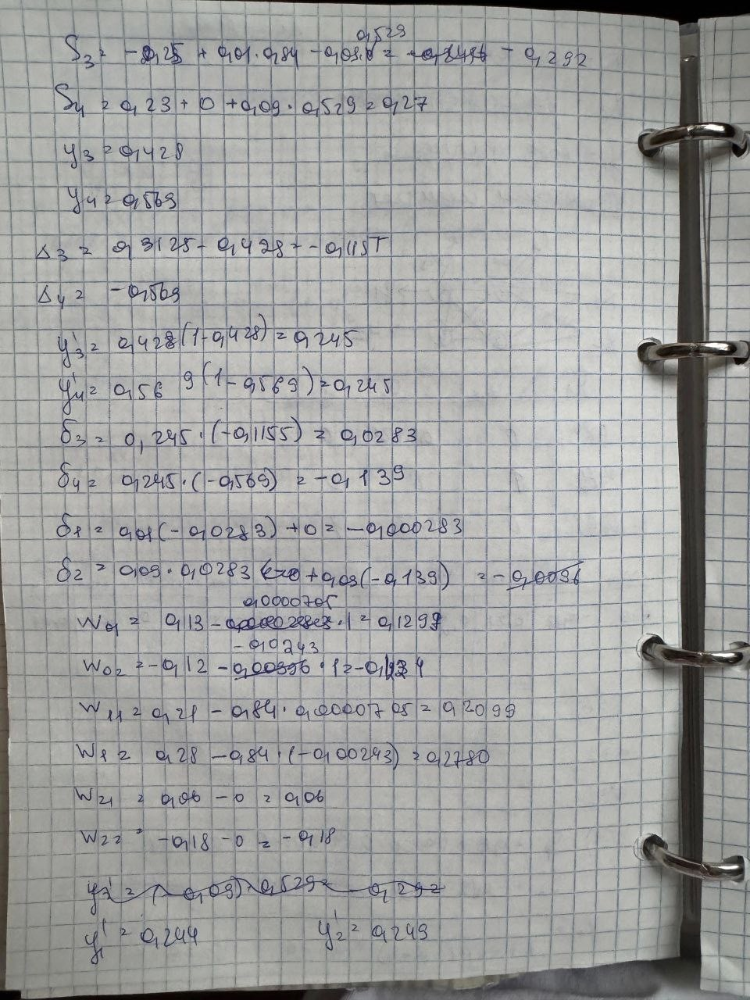
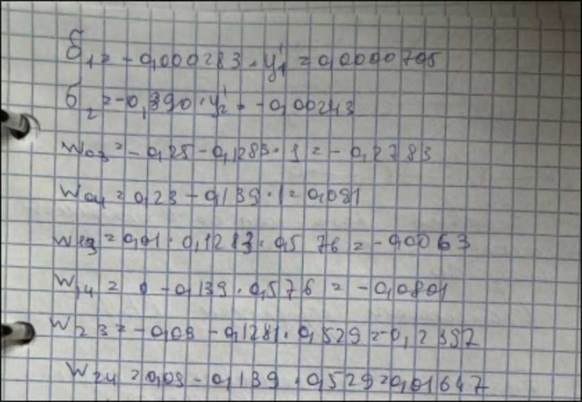

---

## Нейронные сети радиально-базисных функций

Основное свойство `РБФ` заключается в монотонном и симметричном изменении с удалением от начала отсчета
или оси симметрии.

Пример - функция Гаусса
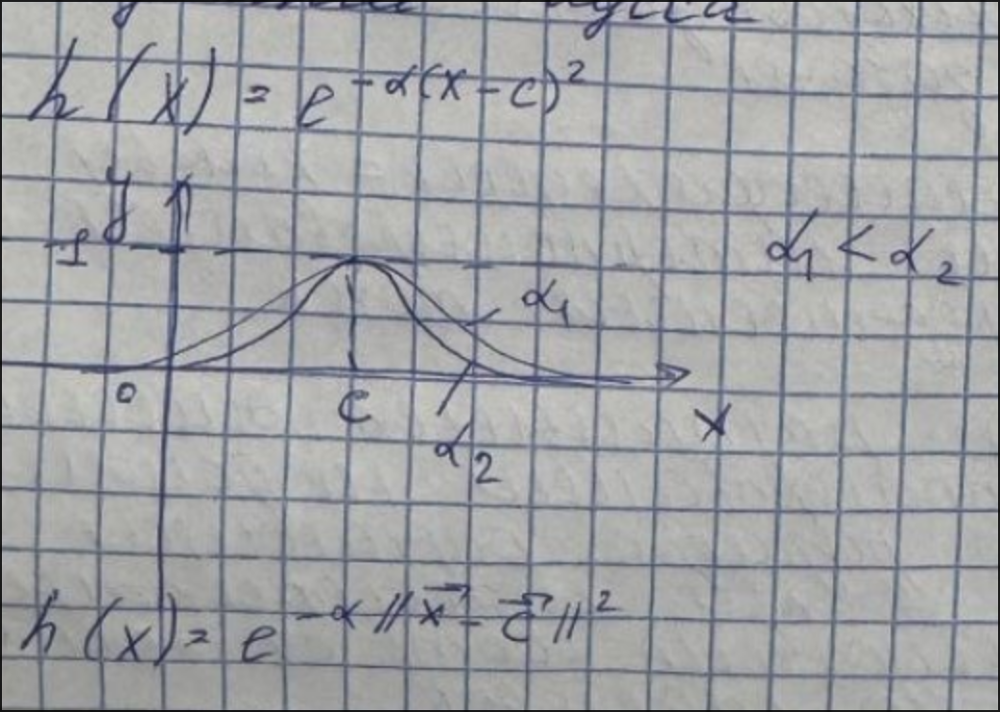

Весовые коэффициенты используются в нейронах 2-го выходного слоя.
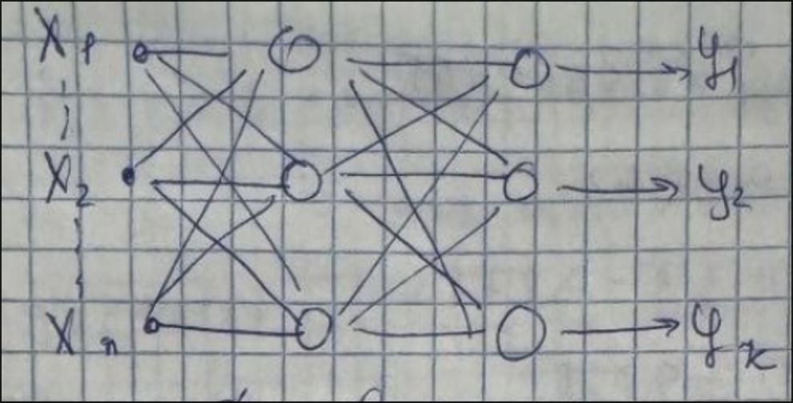

---

### Особенности структуры РБФ сети

1. Благодаря нелинейности скрытого слоя обычно не возникает необходимости наращивать число скрытых
   слоев.

2. Входные переменные - это отличительные признаки классов, кластеров (?)или независимые переменные
   интерполирующей зависимости(?).

3. Количество выходов зависит от класса решаемой задачи.

4. При классификации = кол-ву классов. При интерполировании - кол-ву определяемых точек.

5. Кол-во радиальных элементов при интерполировании не должно превышать размера обучающей выборки. А при
   классификации и кластеризации соответствует кол-ву классов или кластеров.

---

### Алгоритм обучения

1. Стадия настройки сети.
Определяются значения центров радиальных элементов и параметры насыщения.

2. Оптимизация весовых коэффициентов:
    1. Расчет характеристической матрицы радиальных элементов всех обучающих примеров.
    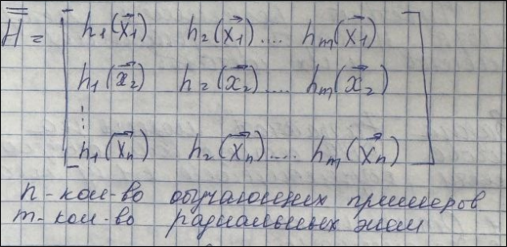
    2. Расчет весовых коэффициентов нейронов 2-го слоя.
    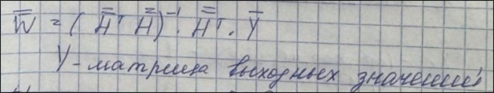

---

### Преимущества РБФ сетей

1. Наличие единственного скрытого слоя, достаточного для описания ярко выраженных нелинейных
   зависимостей.

2. Простота метода оптимизации весов.

3. Гарантированное нахождение глобального оптимума весовых коэффициентов.

4. Высокая скорость обучения.

---

### Основные недостатки

1. Необходимость спец. настройки параметров радиальных элементов.

2. Чувствительность решения к методу выбора центров радиальных элементов и их составов.

---

## Пример

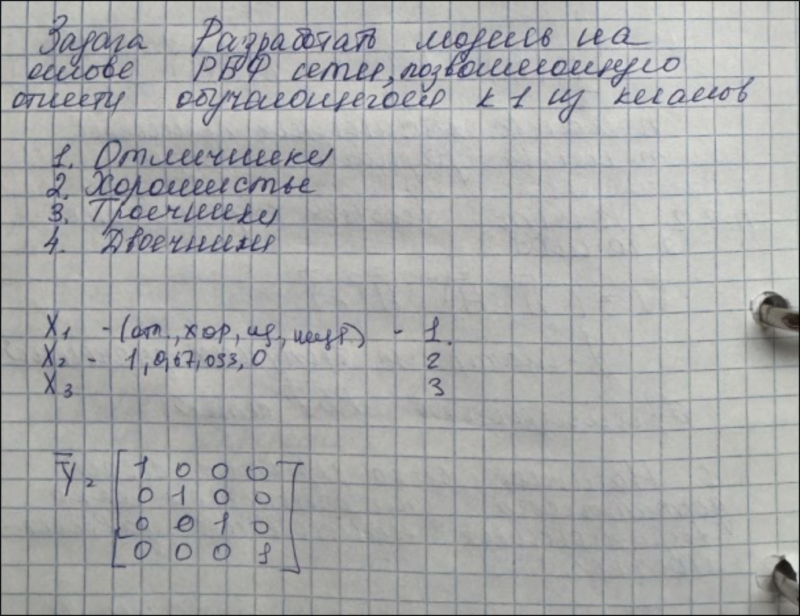
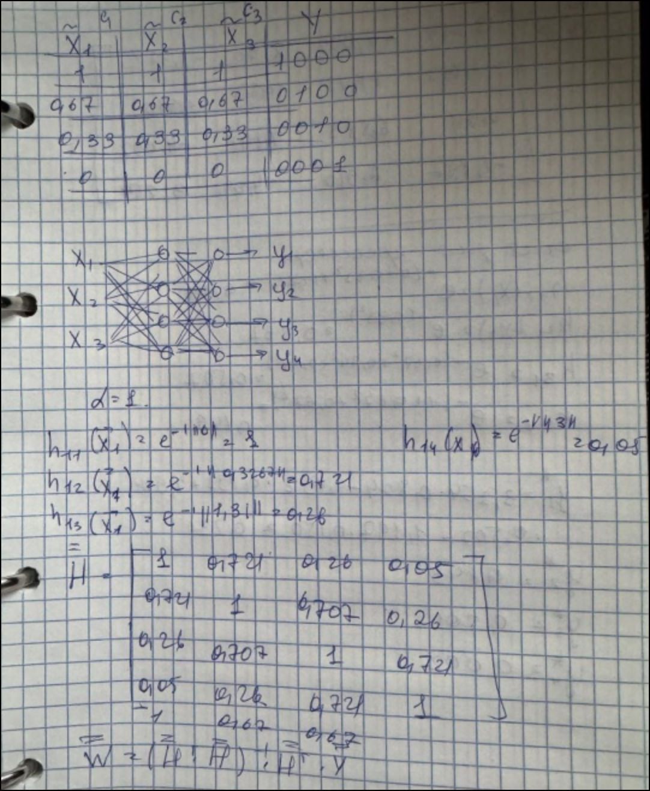
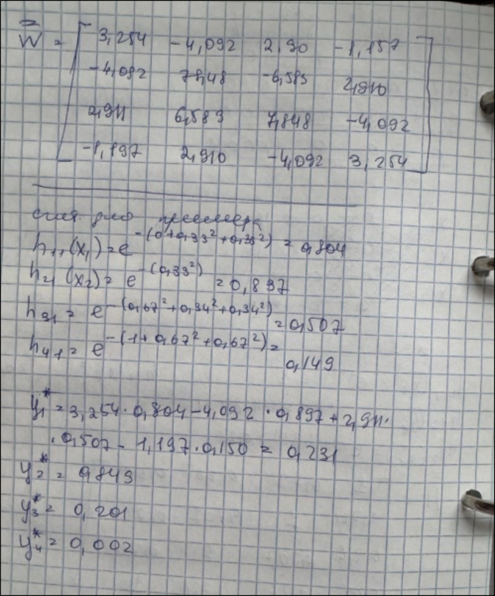

---

# Информация из методы

## Нейронные сети на основе радиально-симметричных(радиально-базисных) функций

Искусственные нейронные сети на основе радиально-симметричных (радиально-базисных) функций могут использоваться для решения широкого круга задач, среди которых наиболее частые – аппроксимация, классификация и кластеризация данных.

Основное свойство радиально-симметричных функций – это монотонное и симметричное относительно некоторой вертикальной оси симметрии изменение (убывание или возрастание) их откликов.

В качестве примера такой функции может служить рассмотренное ранее выражение функции Гаусса:
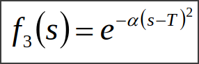

Именно эта функция наиболее часто используется в рассматриваемой архитектуре нейронных сетей, однако главным образом, в ее многомерном случае:

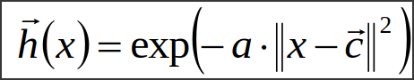

где c – вектор центров (координат вертикальных осей симметрии) множества радиально-симметричных функций; ||x - c|| – норма вектора отклонений входной переменной от центров радиально-симметричных функций.
Параметр α связан с радиусом рассеяния входных переменных r и может быть заменен в выражении выше на соответствующее отношение:

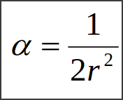

Норма разности векторов рассчитывается как евклидово расстояние:

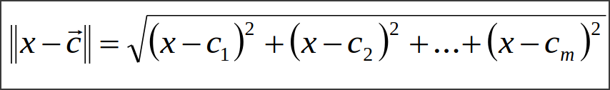

На рис. 10.1 приведена типовая структура искусственной нейронной сети на основе радиально-симметричных функций.

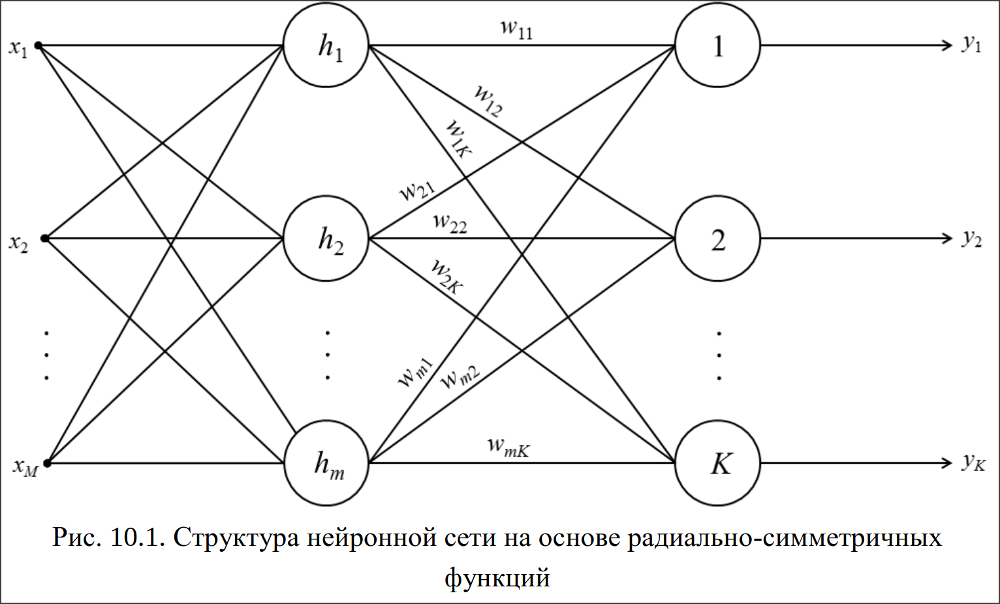

Данная структура содержит два слоя нейронов. Выходы первого слоя активируются множеством радиально-симметричных функций (10.1). Фактически они обрабатывают вектор входных значений, определяя степень близости каждого из них к центрам радиально-симметричных функций. Выходы нейронов второго слоя (т.е. выходы всей нейронной сети) – это линейные комбинации выходов первого слоя.

Жизненный цикл нейросети на радиально-симметричных функциях включает обучение (настройка нейронной сети и оптимизация синаптических коэффициентов линейного выходного слоя) и практическое использование.

На этапе **настройки** рассматриваемой нейронной сети необходимо определить центры c и радиусы r радиальных элементов (нейронов скрытого слоя).

1. Если обучающих образцов мало, центры радиально-симметричных функций выбирают по их векторам. При большом объеме данных используют либо центры кластеров, либо случайные примеры (второй вариант предпочтителен при большом числе нейронов).
2. Радиусы радиальных элементов зависят от параметра α: слишком большие значения ухудшают обобщение, слишком малые — снижают чувствительность к деталям. Радиусы задаются вручную или рассчитываются автоматически по среднему расстоянию до ближайших примеров.

На этапе **оптимизации весовых коэффициентов** линейного выходного слоя последовательно выполняются следующие действия.

1. Рассчитывается характеристическая матрица значений радиально-симметричных элементов всех обучающих примеров:

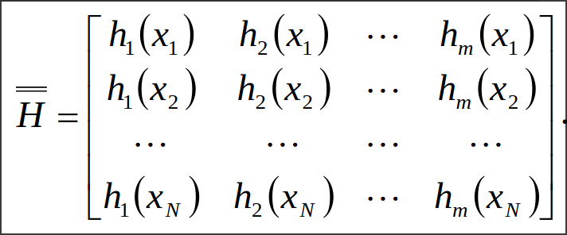

Количество строк данной матрицы равно количеству примеров обучающей выборки. Количество столбцов – количеству радиальных элементов.

2. Методами линейной алгебры рассчитывается матрица весовых коэффициентов выходного слоя нейронов:

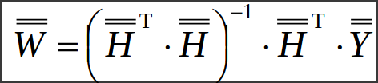

где матрица выходов обучающих примеров содержит столбцы в количестве, равном числу обучающих примеров, и строки в количестве, соответствующем числу выходов нейронной сети:

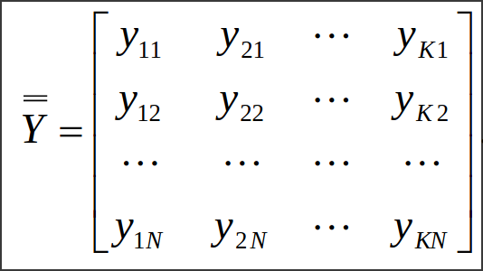

---

## Преимущества рассматриваемой архитектуры нейронных сетей

– наличие единственного скрытого слоя, достаточного для модели-
рования ярко выраженных нелинейных зависимостей;
– простота алгоритма оптимизации весовых коэффициентов;
– гарантированное нахождение глобального оптимума функции
ошибки при нахождении весовых коэффициентов нейронов выходного
слоя;
– высокая скорость обучения.

---

## Недостатки нейронных сетей на основе радиально-симметричных функций

– необходимость специальной настройки параметров радиально-
симметричных функций, сложность настройки при большом количестве
скрытых радиальных элементов;
– невозможность экстраполирования модели за пределами исходного
интервала изменения входных значений обучающей выборки.

---
