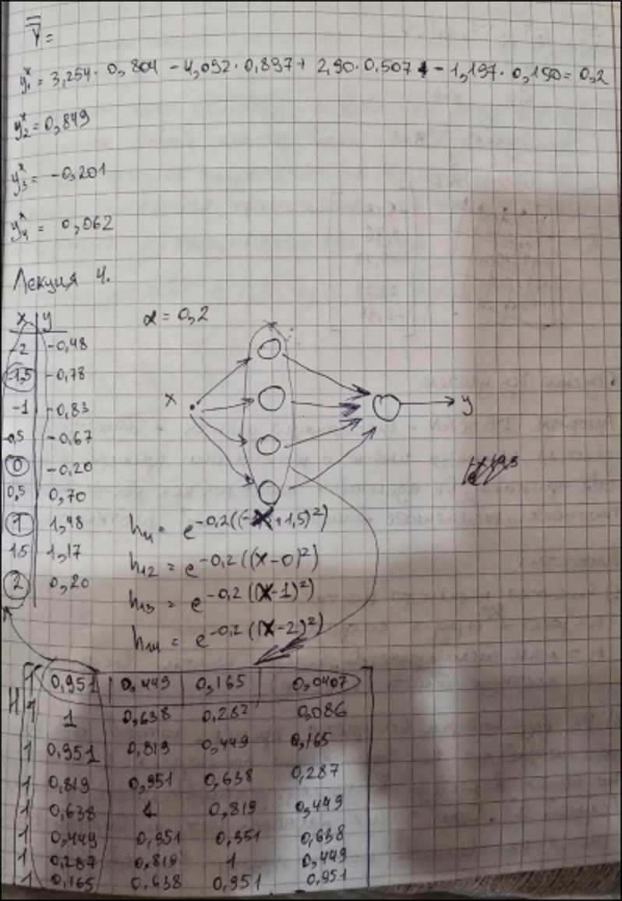
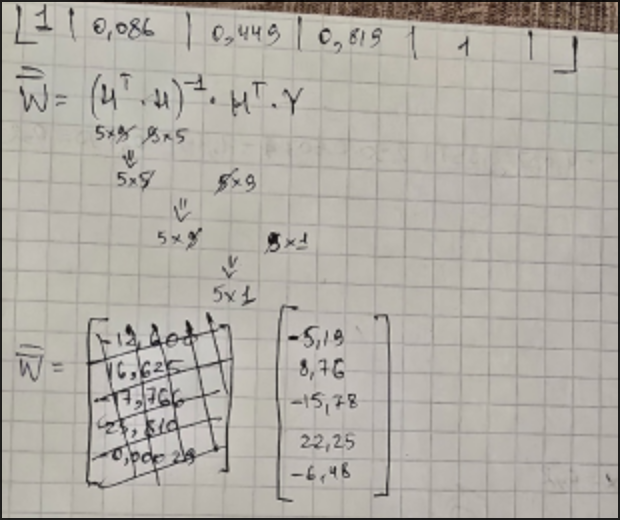

# Лекция 4

## Пример

## Обучение без учителя

* **Алгоритм DBSCAN** - кластеризация данных - обучается без учителя, используя информацию о
  расположении примеров в пространстве признаков. Он идентифицирует кластеры как области высокой
  плотности, разделенные областями низкой плотности.

Алгоритм:

