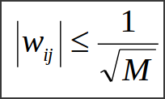

# Понятие самообучения и самоорганизации нейронных сетей Кохонена

1. Алгоритм самообучения НС Кохонена фиксированной структуры.
    1. Задание структуры НС(количество кластеров) и настроек алгоритма обучения(коэф. скорости `v`).

2. Случайная инициализация весовых коэффициентов в соответствии с выбранной областью допустимых значений
   входных переменных.

3. Подача на вход сети случайного примера текущей эпохи обучения и расчет евклидовых расстояний до
   центра каждого кластера.

4. По наименьшему из значений евклидовых расстояний выбирается нейрон победитель и только для нейрона
   победителя выполняется коррекция весовых коэффициентов.

5. Цикл повторяется с `П.3` до выполнения 1-го или нескольких условий окончания:
    1. Исчерпание предельно заданного количества эпох обучения.
    2. Отсутствие значимого изменения W - коэффициентов на протяжении эпохи.
    3. Исчерпание предельного физического времения обучения.

---

## Пример

---

## Алгоритм самоорганизации НС Кохонена

1. Начальная структура НС не содержит нейронов. Вместо количества нейронов задается критическое
   расстояние R_крит, соответствующее максимально допустимому евклидову расстоянию, при котором
   определяется нейрон победитель; задается `v`.

2. На входы НС подается случайный пример текущей эпохи и рассчитываются евклидовы расстояния до всех
   существующих нейронов с учетом ограничения на расст-ния опред-ся нейрон-победитель.

3. Если нейрон-победитель есть, его веса корректируются по соотношению:

Если нейрона-победителя нет, создается новый нейрон с весовыми коэффициентами, равными элементам
поданного входного вектора.

4. Процедура повторяется с `П.2` до выполнения одного из условий окончания(см. в предыдущем алгоритме).

---

## Пример

---

# Информация из методы

## Нейронные сети Кохонена

Нейронные сети Кохонена – типичный пример нейросетевой архитектуры, обучающейся без учителя. Отсюда и перечень решаемых ими задач: кластеризация данных или прогнозирование свойств. Кроме того, сети Кохонена могут использоваться с целью уменьшения размерности данных с минимальной потерей информации.

В рассматриваемой архитектуре сигнал распространяется от входов к выходам в прямом направлении. Структура нейронной сети содержит единственный слой нейронов (слой Кохонена) без коэффициентов смещения (рис. 11.1). Общее количество весовых коэффициентов рассчитывается как произведение:

Количество нейронов равно количеству кластеров, среди которых происходит начальное распределение и последующее перераспределение обучающих примеров. Количество входных переменных нейронной сети равно числу признаков, характеризующих объект исследования и на основе которых происходит отнесение его к одному из кластеров.

Следует различать собственно самообучение и самоорганизацию нейронной сети Кохонена. При обычном **самообучении** сеть имеет строго фиксированную структуру, т. е. количество нейронов, не изменяющееся на протяжении всего жизненного цикла. При **самоорганизации** сеть, напротив, не имеет постоянной структуры. В зависимости от найденного расстояния до нейрона-победителя либо этот нейрон используется для кластеризации примера, либо для поданного на входы примера создается новый кластер с соответствующими ему весовыми коэффициентами. Кроме того, в процессе самоорганизации структуры сети Кохонена отдельные нейроны могут исключаться из нее.

Нормализация входных переменных выполняется в пределах [–1, 1] или [0, 1].

Для жизненного цикла нейронных сетей данной архитектуры характерны три основных стадии жизненного цикла: обучение, кластерный анализ и практическое использование.

---

Алгоритм **обучения** сети Кохонена включает этапы, состав которых зависит от типа структуры: постоянной (самообучающаяся сеть) или переменной (самоорганизующаяся сеть). Для **самообучения** последовательно выполняются:

1. Задание структуры сети (количества нейронов слоя Кохонена) (K).

2. Случайная инициализация весовых коэффициентов значениями,
удовлетворяющими одному из следующих ограничений:
    - при нормализации исходной выборки в пределах [–1, 1]: 
    - при нормализации исходной выборки в пределах [0, 1]: 
где M – количество входных переменных сети – характеристических признаков объекта исследования.

3. Подача на входы сети случайного обучающего примера текущей эпохи обучения и расчет евклидовых расстояний от входного вектора до центров всех кластеров:

4. По наименьшему из значений Rj выбирается нейрон-победитель j, в наибольшей степени близкий по значениям с входным вектором. Для выбранного нейрона (и только для него) выполняется коррекция весовых коэффициентов:

где v – коэффициент скорости обучения.

5. Цикл повторяется с шага 3 до выполнения одного или нескольких условий окончания:
    - исчерпано заданное предельное количество эпох обучения;
    - не произошло значимого изменения весовых коэффициентов в пределах заданной точности на протяжении последней эпохи обучения;
    - исчерпано заданное предельное физическое время обучения.

Коэффициент скорости обучения может задаваться постоянным из пределов `(0, 1]` или переменным значением, постепенно уменьшающимся от эпохи к эпохе.

---

В случае **самоорганизации** сети Кохонена алгоритм претерпевает определенные изменения:

1. Задается критическое расстояние Rкр, соответствующее максимально допустимому евклидову расстоянию между входами примера и весами нейрона-победителя. Начальная структура не содержит нейронов. При подаче на входы сети самого первого примера обучающей выборки создается первый нейрон с весовыми коэффициентами, равными поданным входным значениям.

2.  На входы сети подается новый случайно выбранный пример текущей эпохи обучения, рассчитываются евклидовы расстояния от примера до центра каждого кластера по соотношению  и определяется нейрон-победитель с наименьшим из них Rmin.

3. Если выполняется условие Rmin <= Rкр, производится коррекция весовых коэффициентов соответствующего нейрона-победителя по соотношению , в противном случае в структуру сети добавляется новый нейрон, весовые коэффициенты которого принимаются численно равными входным значениям поданного примера.

4. Процедура повторяется с `п.2`. Если на протяжении последней эпохи обучения какие-либо кластеры остались не задействованными, соответствующие нейроны исключаются из структуры сети Кохонена.

5. Вычисления заканчиваются, если выполняется одно из условий, прописанных в алгоритме самообучения сети фиксированной структуры.

---

Еще одна модификация алгоритмов самообучения и самоорганизации предусматривает коррекцию весовых коэффициентов не только нейрона-победителя, но и всех остальных нейронов. Для этого следует использовать коэффициент скорости обучения, убывающий с увеличением расстояния до центра кластера `Rj`:

где `Rкр` – критическое значение расстояния: чем оно меньше, тем более значительны будут корректировки весов самых близких к обучающему примеру кластеров и практически незначимы – весов более-менее удаленных от него; `β` – параметр, устанавливающий степень нелинейности влияния расстояния на коэффициент скорости; `v0` – базовое (максимально возможное) значение коэффициента скорости на текущей эпохе обучения.

В качестве значения `Rкр` можно рассчитывать среднее расстояние для каждого кластера при текущем предъявлении обучающего примера. Параметр `β` рекомендуется выбирать равным `3,0 ± 0,5`.

К обученной нейронной сети применяется процедура **кластерного анализа** – процедуры описания свойств кластера на основе анализа количественного и качественного составов примеров, сформировавших его. Следует учитывать, что описание кластеров может базироваться не только на значениях входных переменных обучающей выборки, но и на значениях переменных, не участвовавших в формировании кластеров. В частности, в описание могут входить данные о средних значениях таких переменных среди всех примеров, сформировавших кластер. Кроме того, целесообразно для каждого кластера иметь данные о среднеквадратическом отклонении или дисперсии по каждой переменной.

При **практическом использовании** нейронной сети Кохонена новый пример подается на ее вход и относится к одному из существующих кластеров, либо делается вывод о невозможности такого отнесения (при большом расстоянии до центра ближайшего кластера). Если выбор кластера состоялся, его описание, полученное в результате кластерного анализа, и соответствующие кластеру решения должны распространяться в том числе на поданный пример.

Практическое использование сети Кохонена облегчается за счет визуализации результатов кластеризации. В результате самообучения (самоорганизации) сети получается набор кластеров, каждый из которых характеризуется своим центром (значениями весовых коэффициентов соответствующего нейрона) и количеством обучающих примеров, сформировавших его. Не составляет никакого труда определить евклидово расстояние между центрами всех возможных пар кластеров и графически изобразить их на так называемой **карте Кохонена** – двумерной графической структуре, позволяющей судить не только о размерах и положении каждого отдельно взятого кластера, но и о близости друг к другу и взаимном расположении отдельных кластеров.
