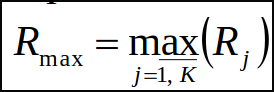

# Теория адаптивного резонанса

## Нейронные сети адаптивного резонанса

Нейросети адаптивного резонанса решают 2 основные задачи:

1. Кластеризация нового образа(анализ возможности отношения к 1 из имеющихся кластеров)

2. Запоминание нового образа, если он не может быть отнесен ни к 1 из кластеров.

Основные архитектуры `ART1` и `ART2`.

Сеть `ART1` используется для обработки и хранения образов в форме двоичных сигналов, `ART2` для работы
как с двоичными, так и аналогово-представленными образами.

В отличие от большинства существующих архитектур нейронных сетей АРТ-сети не предусматривают строгого деления жизненного цикла на стадии обучения и практического использования. Они продолжают обучаться на протяжении всего времени их практического использования, включая этап практической эксплуатации. Структура любой АРТ-сети содержит единственный слой нейронов. Количество входных переменных равно количеству двоичных или вещественных признаков, характеризующих объект. Количество выходов непостоянно. В момент начала функционирования сети выходов нет вовсе. Постепенно их количество возрастает с каждым новым незнакомым входным образом, образующим, по сути, новый кластер. Таким образом, очевидно, что АРТ-сети – самоорганизующиеся.

---

### Алгоритм работы ART1

---

### Пример

---

### Алгоритм работы ART2

---

### Пример

---

# Информация из методы

## Нейронные сети адаптивного резонанса

Человеческий мозг непрерывно занимается обработкой информации, поступающей от органов чувств: звуки, запахи, изображения и т. д. Большая часть такой информации не представляет интереса или неважна и поэтому игнорируется. Однако та небольшая ее составляющая, что имеет ценность, должна быть не только обработана, но и сохранена в долговременной памяти. Важно понимать, что при этом не только новые образы должны запоминаться, но также должны идентифицироваться ранее встречавшиеся. В свою очередь, запоминание новых образов не должно влиять на образы, хранящиеся в памяти.

Приведенные особенности работы человеческого мозга отражены в теории адаптивного резонанса. Несмотря на существование в настоящее время сравнительно большого количества вариантов архитектур искусственных нейронных сетей адаптивного резонанса, основными остаются две:

* `АРТ-1` (от англ. ART – Adaptive Resonance Theory) – для кластеризации, хранения и идентификации образов в форме двоичных сигналов;
* `АРТ-2` – для кластеризации, хранения и идентификации образов, представленных как в форме двоичных сигналов, так и в форме аналоговых сигналов, в том числе с использованием обоих типов сигналов в одной структуре.

В отличие от большинства существующих архитектур нейронных сетей АРТ-сети не предусматривают строгого деления жизненного цикла на стадии обучения и практического использования. Они продолжают обучаться на протяжении всего времени их практического использования, включая этап практической эксплуатации.

Структура любой АРТ-сети содержит единственный слой нейронов. Количество входных переменных равно количеству двоичных или вещественных признаков, характеризующих объект. Количество выходов непостоянно. В момент начала функционирования сети выходов нет вовсе. Постепенно их количество возрастает с каждым новым незнакомым входным образом, образующим, по сути, новый кластер. Таким образом, очевидно, что АРТ-сети – самоорганизующиеся.

Рассмотрим структуру и алгоритм работы `нейронной сети АРТ-1`(рис. 12.1).

В отличие от большинства структур других нейронных сетей входы АРТ-1 связаны с выходами не одним, а парой синапсов: wij – синапсы кратковременной памяти; tij – синапсы долговременной памяти. Назначение кратковременной памяти – установление кластеров, к которым может быть отнесен входной образ. Назначение долговременной памяти – установление степени соответствия входного образа кластерам, определение нейрона-победителя или принятие решения о создании нового кластера.

Поскольку АРТ-1 работает с бинарными входами (0 или 1), никакая дополнительная нормализация или масштабирование входных данных не требуются.

---

### Алгоритм функционирования ART-1

Алгоритм функционирования АРТ-1 включает 3 стадии жизненного цикла: инициализацию сети, распознавание образа, кластеризацию образа(сравнение). На стадии инициализации последовательно выполняются следующие этапы:

1. Стадия инициализации.
    1. Устанавливается параметр сходства Rкр (0 < Rкр < 1), причем чем он больше, тем выше должно быть сходство образа и кластера для отнесения к последнему.
    2. Для первого поданного на входы сети образа создается первый нейрон (кластер), значения синаптических связей которого устанавливаются согласно следующим соотношениям: (12.1, 12.2 соотв.), где λ – положительная (> 1.0) константа, определяющая степень влияния нового входного образа на кратковременную память. Чаще всего λ принимается равной 2.0

2. Стадия распознавания образа.
    1. На входы сети подается новый входной образ. Для каждого нейрона рассчитывается значение его выхода с учетом коэффициентов кратковременной памяти: 
    2. Положительные выходы нейронов указывают на кластеры, имеющие качественное сходство с входным образом. Если же все выходы оказались нулевыми, входной образ не соответствует ни одному из кластеров, создается новый нейрон с синаптическими коэффициентами, рассчитываемыми по соотношениям (12.1) и (12.2), после чего алгоритм продолжает работу с п. 2.1.

3. Стадия кластеризации образа(сравнения).
    1. Рассчитывается количественная мера сходства входного образа с кластером, имеющим наибольшее значение выхода нейрона в п. 2.1: 
    2. Если выполняется условие Rj > Rкр, j-й нейрон считается нейроном-победителем, а входной образ – соответствующим j-му кластеру. В этом случае для нейрона выполняется пересчет весовых коэффициентов по
соотношениям: , где v – коэффициент скорости адаптации (0 < v < 1). Большее значение v соответствует быстрой адаптации, меньшее – медленной.
    3. Если условие Rj > Rкр не выполняется, алгоритм повторяется с п. 3.1 для остальных кластеров, следующие в порядке убывания их выходных значений, рассчитанных в п. 2.1, до тех пор, пока не будет получен нейрон-победитель или не будут использованы все кластеры с положительным выходом нейрона.
    4. Если нейрон-победитель не найден, создается новый кластер с синаптическими коэффициентами нейрона, рассчитанными по соотношениям (12.1) и (12.2), после чего алгоритм продолжает работу с п. 2.1.

---

### Алгоритм функционирования ART-2

В отличие от предыдущей разновидности архитектуры `нейронная сеть АРТ-2` позволяет использовать как бинарные, так и аналоговые входные сигналы. Алгоритм ее функционирования включает две стадии жизненного цикла: инициализацию и кластеризацию (сравнение) образов.

1. Стадия инициализации.
    1. Устанавливается параметр сходства Rкр, аналогичный по физическому смыслу и области допустимых значений такому же параметру архитектуры АРТ-1.
    2. Для имеющейся выборки данных выполняется нормализация значений переменных в пределах [0, 1].
    3. Производится нормирование элементов каждого входного вектора таким образом, чтобы сумма квадратов этих элементов равнялась 1: 
    4. Создается первый нейрон (кластер) с весовыми коэффициентами, численно равными нормированным входным значениям первого примера (образа): 

2. Стадия кластеризации образа (сравнения).
    1. На входы нейронной сети подается очередной образ и определяется количественная мера его сходства с каждым из имеющихся кластеров: 
    2. Выбирается кластер с номером J с максимальным значением меры сходства:
       
    3. Если условие Rmax < Rкр выполняется, считается, что сходство входного образа ни с одним из кластеров не установлено. В этом случае создается новый нейрон (кластер) с весовыми коэффициентами, равными элементам соответствующего нормированного вектораx x^.
    4. Если условие Rmax >= Rкр не выполняется, считается, что установлено наибольшее сходство входного образа с кластером J. Тогда весовые коэффициенты соответствующего нейрона пересчитываются по соотношению: 

Далее алгоритм продолжает работу на стадии кластеризации с п. 2.1.

Следует заметить, что возможно провести настройку нейронной сети путем многократной подачи примеров обучающей выборки на входы с уменьшающимся от эпохи к эпохе коэффициентом скорости адаптации. В этом случае целесообразно каждый раз использовать новую случайную последовательность примеров.
