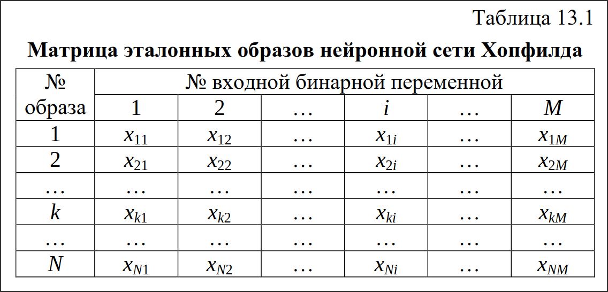

# Н.С. автоассоциативной памяти

---

# Информация из методы

## Автоассоциативная память

Человеческая нервная система получает и обрабатывает огромное количество сигналов, поступающих из окружающего пространства. Если эти сигналы могут быть осмыслены человеком и им могут быть сопоставлены соответствующие образы, принято говорить о работе **ассоциативной памяти**.

Получаемые сигналы имеют различное происхождение и различную форму. Часть их свидетельствует о явлениях или событиях, непосредственно влияющих на жизнедеятельность людей. В таких случаях они, как правило, представляют собой информационный массив, который необходимо правильно интерпретировать, очистив от шума. Таким образом, по сути, решается задача распознавания образа, закодированного массивом, имеющего те же размерность, размеры и физический смысл переменных. Соответствующую категорию ассоциативной памяти называют **автоассоциативной**.

Значительная часть информации, получаемой человеком в виде сигналов из окружающей среды, не несет для него какого-либо смысла, оставаясь информационным фоном, и, соответственно, человек не придает ей какого-либо значения. Однако возможно совпадение по времени получения этой и более ценной, жизненно необходимой информации. Так, определенные запахи или музыкальный мотив могут напомнить о событии в жизни человека или о другом человеке. То есть, один конкретный информационный образ, возможно, и зашумленный, непосредственно ассоциируется с другим образом. В этом случае говорят о гетероассоциативной
памяти, которой посвящен следующий конспект.

Типичный пример имитации автоассоциативной памяти в нейроинформатике – нейронная сеть Хопфилда. Структура данной сети содержит единственный слой нейронов. Количества входных и выходных переменных совпадают (M = K), а сами переменные должны соответствовать друг другу по физическому смыслу и представляют собой бинарные признаки образов, хранимых в памяти сети. Значения входов и выходов: +1 или –1. Сигналы выходных нейронов направляются по обратным связям ко всем остальным нейронам, поэтому данную сеть можно считать полносвязной. Общая структура нейронной сети Хопфилда изображена на рис. 13.1.

Общая постановка задачи, решаемой с помощью нейронной сети Хопфилда, следующая. Известен набор из N эталонных образов, которые должны храниться в памяти сети и, при необходимости, правильно распознаваться ею. Каждый образ – это вектор, состоящий из M идеальных входных сигналов. После обучения сети Хопфилда она должна уметь из поданного на ее вход зашумленного вектора выделить (распознать) один из заложенных в нее эталонных образов или дать заключение, что входные данные не соответствуют ни одному из них.

---

### Алгоритм жизненного цикла нейронной сети Хопфилда

1. Стадия обучения.
    1.  Составляется матрица эталонных образовX размера NxM (табл. 13.1). Поскольку архитектура сети предусматривает использование лишь бинарных входов, никаких дополнительных нормализации и нормировки данных не требуется.
    
    2. Рассчитываются элементы wji матрицы весовых коэффициентов W:
    
    
    или в матричной форме записи:

    

Очевидно, что квадратная матрица W симметрична относительно нулевой главной диагонали.

2. Стадия практического использования.
    1. На входы сети подается неизвестный, в общем случае, зашумленный вектор-столбец сигналов x*. Выходам нейронов присваиваются соответствующие значения элементов входного вектора: 
    2.  Пересчитываются состояния нейронов для следующей (q+1) итерации: 
    
    
    
    или в матричной форме:

    

    3. Рассчитываются новые значения элементов выходного вектора:
    
    

    или в матричной форме:

    

    где f(s) – активационная функция в виде повышающегося единичного скачка с бинарным множеством допустимых значений {–1; 1}:
    
    

    Порог активации T обычно принимается равным нулю.

    4.
