# Лекция 8

## Н.С. Коско

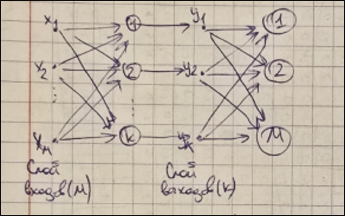

Ограничения практического использования:

Количество ассоциаций, хранимых в памяти сети(N), не должно превышать 15% от наименьшего количества
нейронов среди слоев(K, M).

При большем количестве N должно соблюдаться следующее неравенство: 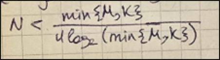

Особенности реализации:

1. Можно задавать различные(негомогенная сеть) или одинаковые(гомогенная сеть) значения порога T
   активационной функции.

2. При решении задачи классификации каждый класс описывается вектором, содержащим значение 1 в
   уникальной позиции, соответствующей данному классу(более предпочтительный вариант), или вектором с
   уникальной комбинацией значений -1 или +1 (менее предпочтительный вариант).

---

## Н.С. Хемминга

Н.С. Хемминга - двухслойная НС, является рекуррентной, имеет обратные связи(для подачи выходных сигналов
второго слоя на входы второго слоя); бинарное кодирование входов; входы - признаки, по которым
различаются объекты; количество нейронов в обоих слоях соответствует количеству классов; выходы -
указатели на класс объекта.

Имеется набор эталонных образов, представленных бинарными векторами. Каждому образу соответствует свой
класс. Требуется поданный на вход обученной сети зашумленный образ сопоставить с известными эталонными
образами и сделать заключение:

* о соответствии одному из эталонов.
* о несоответствии ни одному из эталонов.
* о невозможности выбрать соответствие между несколькими вариантами эталонов.

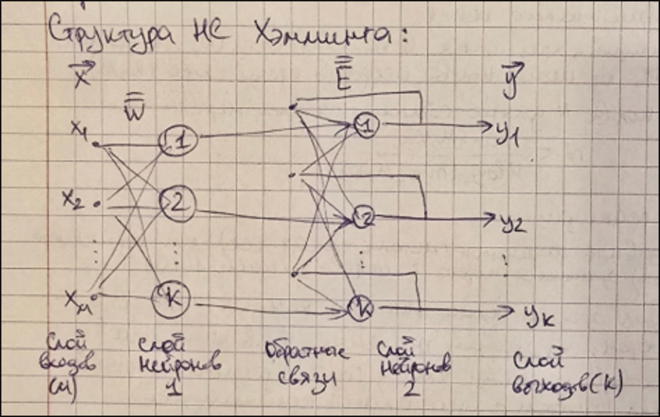

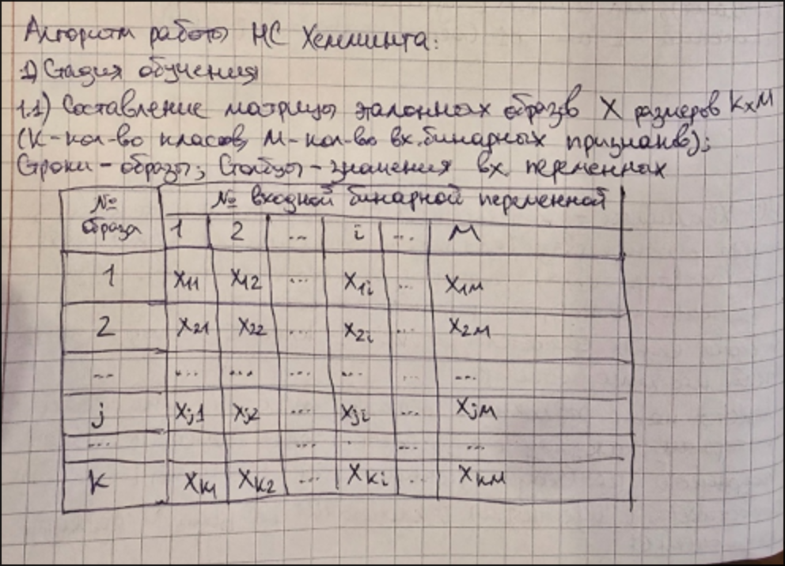

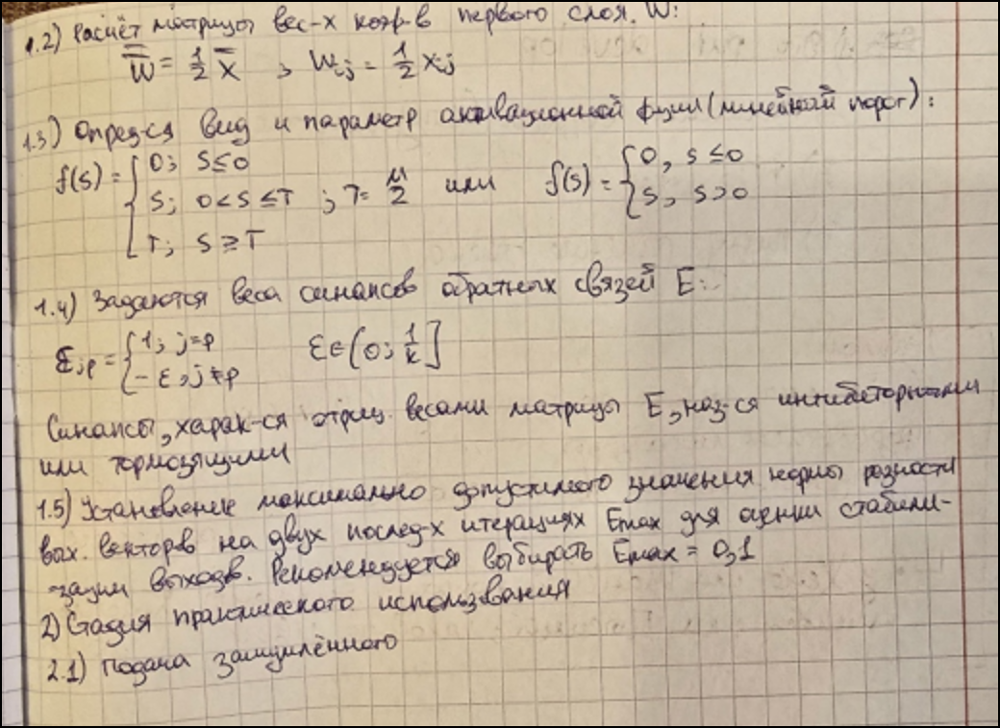

---

## Пример

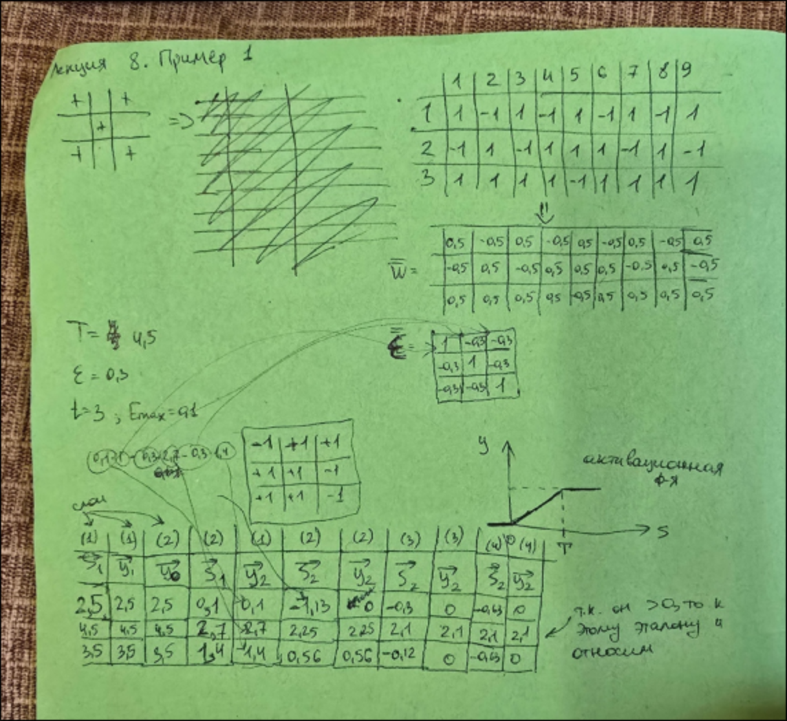

---

# Информация из методы

## Гетероассоциативная память

Одна из характерных особенностей человеческой памяти – возможность ассоциации каких-либо объектов (образов) с другими, непохожими на них или даже с образами-антагонистами. Так, например, в первом случае понятие «зима» ассоциируется с понятием «холод», «праздник» – с «подарком». В случае противоположностей мозгом легко выстраиваются пары: «черный» – «белый», «большой» – «маленький».

На имитацию этой особенности человеческой памяти ориентированы нейронные сети гетероассоциативной памяти – сети Коско, иначе называемые еще сетями двунаправленной ассоциативной памяти. В структуре этой сети (рис. 14.1) два слоя нейронов. Количество нейронов первого слоя K равно количеству бинарных выходных переменных. Число нейронов второго слоя M равно числу бинарных переменных, которые кодируют входной образ, соответствующий выходному. Сами значения входных и выходных переменных принадлежат бинарному множеству {–1; 1}.

В общем случае, задача, решаемая с помощью нейронной сети Коско, ставится следующим образом. Известен набор из N эталонных входных образов и соответствующих им N идеальных выходных образов. После обучения сеть Коско должна уметь из поданного на ее вход зашумленного входного вектора выделить один из заложенных в нее выходных идеальных образов или дать заключение, что входные данные не соответствуют ни одному из них. Таким образом, в отличие от нейронной сети Хопфилда, сеть двунаправленной ассоциативной памяти должна не только избавиться от шума во входном векторе, но и сопоставить соответствующий ему выходной вектор.

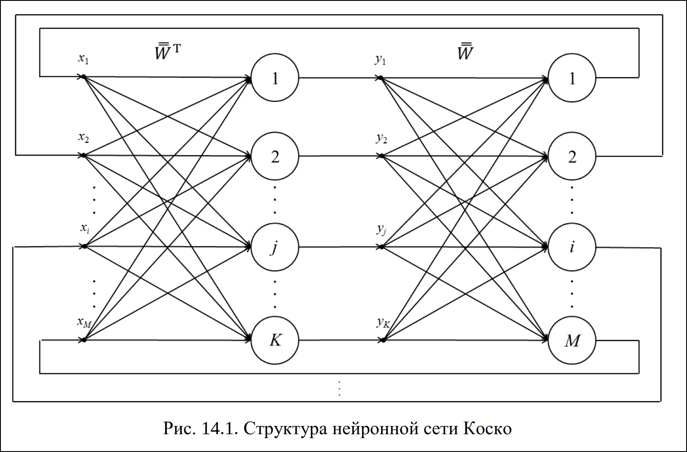

---

### Алгоритм жизненного цикла нейронной сети Коско

Алгоритм жизненного цикла нейронной сети Коско включает две стадии: ***обучения*** и ***практического использования***.

1. Стадия **обучения** содержит следующую последовательность действий:
    1. Формируются матрицы ассоциированных входных и выходных образов. Матрица входных образов X размера NxM аналогична матрице эталонных входных образов нейронной сети Хопфилда (табл. 13.1). Структура матрицы выходных образов Y размера NxK приведена в табл. 14.1.

        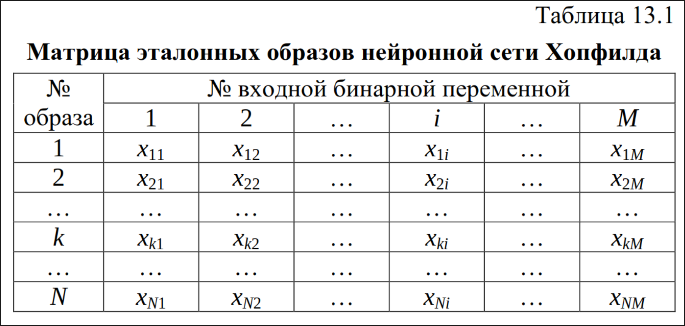

    2. Рассчитываются элементы wij матрицы весовых коэффициентов W:

        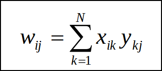

        или в матричной форме записи:

        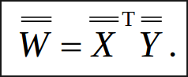

    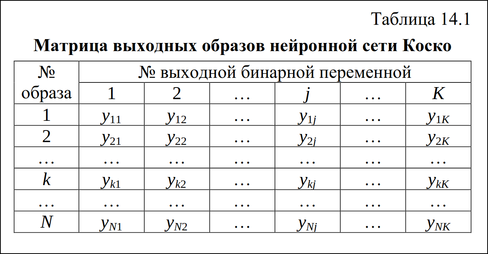

2. На стадии **практического использования** выполняются следующие операции:

    1. Неизвестный, возможно, зашумленный образ x^(0) подается в виде значений элементов входного вектора-столбца в нейронную сеть. Для него или любого следующего (q+1)-го приближения эталонного входного вектора рассчитываются состояния нейронов первого слоя:

        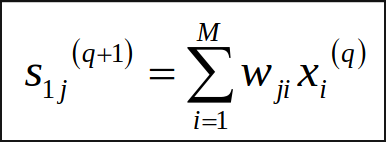

        или в матричной форме:

        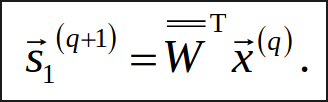

    2. К рассчитанным на предыдущем шаге состояниям нейронов применяется пороговая активационная функция вида (13.5), в результате чего получается новый вектор выходных значений y^(q+1).

        (13.5): 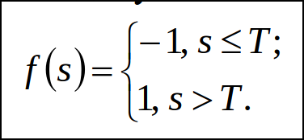

        Если значение порога `T` одинаково для всех нейронов, например, `T = 0`, такая нейронная сеть Коско называется **гомогенной**. Если имеются различающиеся значения порогов, сеть называется **негомогенной**. Негомогенные сети Коско имеет смысл использовать в тех случаях, когда входные или выходные вектора содержат различные по своему происхождению элементы.

    3. Для всех итераций, кроме первой (q ≠ 1), проверяется условие окончания – стабилизация элементов выходного вектора – равенство (13.6). Если оно не выполняется, цикл расчетов продолжается с п. 2.4, иначе – переход к п. 2.6.

        (13.6): 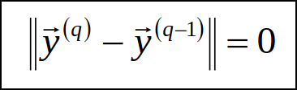

    4. Полученные значения элементов выходного образа подаются на входы нейронов второго слоя, для которого, в свою очередь, рассчитываются новые состояния нейронов:

        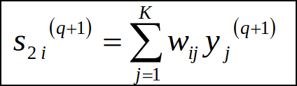

        или в матричной форме:

        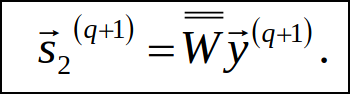

    5. К рассчитанным состояниям нейронов второго слоя также применяется пороговая активационная функция (13.5) и вычисляются элементы нового вектора входного образа x^(q+1).

    6. Проверяется соответствие стабилизировавшегося вектора выходных значений одному из идеальных образов матрицы Y. Если соответствие установлено, можно сделать вывод, что нейронной сети удалось найти ассоциацию между зашумленным входом и одним из идеальных выходов. В противном случае можно сказать, что входной вектор был слишком сильно зашумлен и соответствие не может быть установлено.

---

Искусственная нейронная сеть Коско имеет ограничения, связанные с количеством запоминаемых образов. Если все они достаточно сильно друг от друга отличаются, в первом приближении достаточно выполнения условия: N ≤ n, где n – минимальное из двух слоев количество нейронов. Предельно строгое условие аналогично неравенству (13.8) для сети Хопфилда.

(13.8): 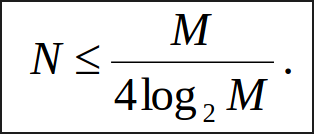

Задачу ассоциации неоднородных образов с помощью нейронной сети Коско можно свести к задаче их классификации. В этом случае количество переменных выходного образа должно соответствовать количеству возможных классов. Для каждого эталонного образа класс кодируется так: в выходном векторе все значения элементов, кроме одного, принимаются равными –1. Единственное положительное значение элемента выходного вектора располагается в позиции, соответствующей нужному классу.

---

## Нейронные сети Хэмминга

Искусственная нейронная сеть Хэмминга используется для решения задач классификации бинарных входных векторов. В основе ее работы лежат процедуры, направленные на выбор в качестве решения задачи классификации одного из эталонных образов, наиболее близкого к поданному на вход сети зашумленному входному образу, и отнесение данного образа к соответствующему классу. Для оценки меры близости к каждому классу используется критерий, учитывающий расстояние Хэмминга – количество различающихся переменных у зашумленного и эталонного входных образов.

Структурно нейронная сеть Хэмминга включает два слоя (рис. 15.1), количество нейронов в которых K равно количеству классов (K = N). Число входов M соответствует числу бинарных признаков, по которым различаются образы. Значения входных переменных принадлежат множеству {–1;1}. Выходные значения подаются по обратным связям на входы нейронов второго слоя, в том числе свой собственный.

Общая постановка задачи, которая решается с помощью нейронной сети Хэмминга, следующая. Имеется исходный набор эталонных образов, представленных в виде бинарных векторов. Каждому из них соответствует свой класс. Требуется для поданного на входы сети неизвестного образа произвести его сопоставление со всеми известными эталонными образами и отнесение к соответствующему классу либо сделать заключение о несоответствии ни одному из классов.

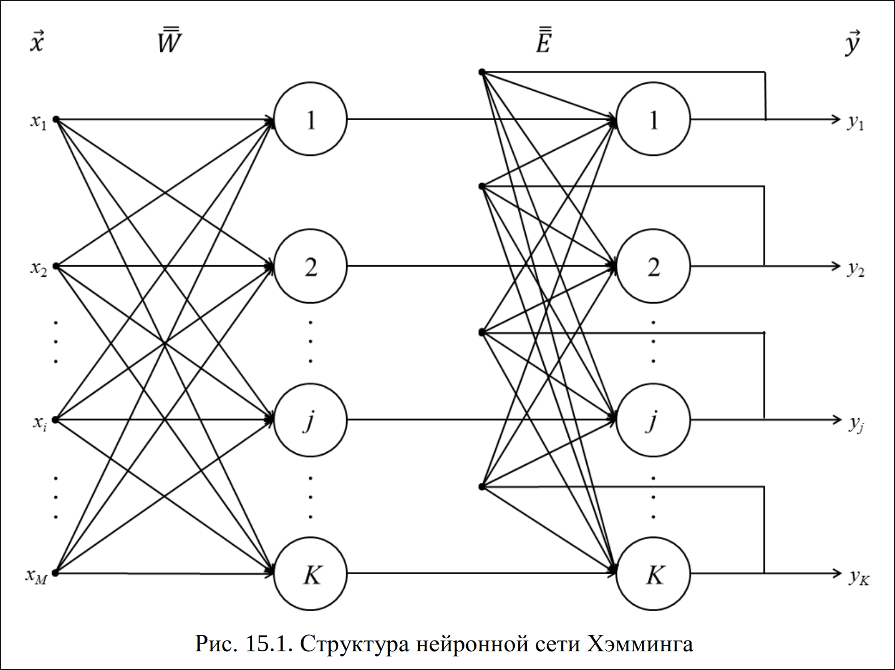

---

### Алгоритм жизненного цикла нейронной сети Хэмминга

Алгоритм жизненного цикла нейронной сети Хэмминга состоит из двух основных стадий: ***обучения*** и ***практического использования***.

1. На стадии **обучения** выполняется следующая последовательность действий:

    1. Формируется матрица эталонных образов X размера KxM(табл. 15.1)

        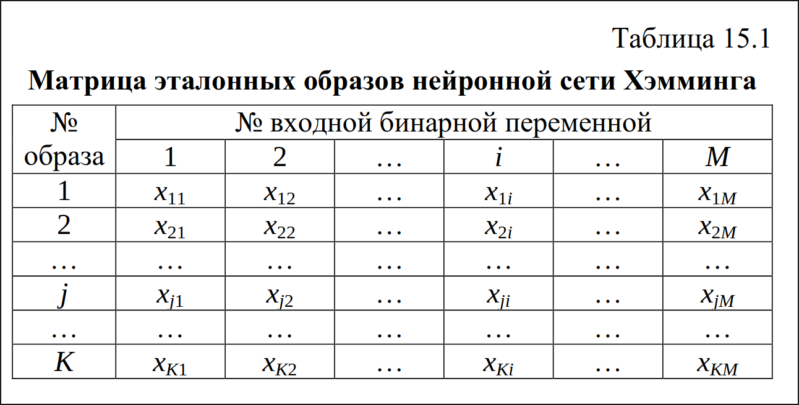

    2. Рассчитывается матрица весовых коэффициентов нейронов первого слоя:

        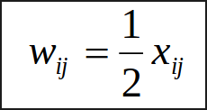

        или в матричной форме записи:

        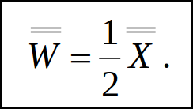

    3. Определяются настройки активационной функции:
        * вид – линейная пороговая функция:

            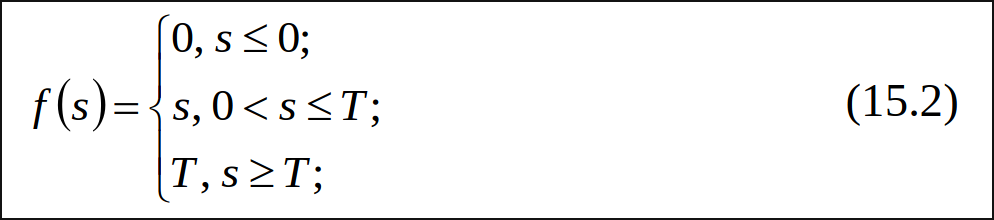

        * параметр:

            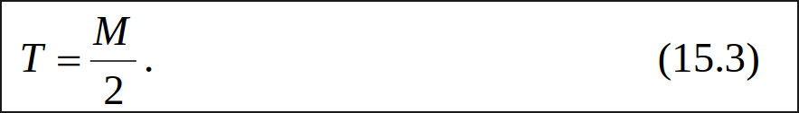

        Таким образом, очевидно, что выходы нейронной сети могут принимать любые значения в пределах [0, T]

    4. Задаются значения синапсов обратных связей нейронов второго слоя в виде элементов квадратной матрицы размера KxK:

        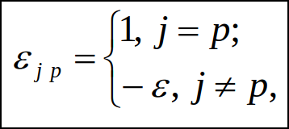

        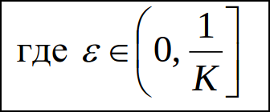

        или в матричной форме:

        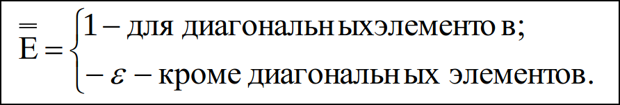

        Синапсы обратных связей нейронной сети Хэмминга, имеющие отрицательный вес, называются **ингибиторными**, или **тормозящими**.

    5. Устанавливается максимально допустимое значение нормы разности выходных векторов на двух последовательных итерациях Emax, требующееся для оценки стабилизации решения. Обычно достаточно принимать Emax = 0,1.

2. На стадии **практического использования** выполняются следующие действия:

    1. На входы сети подается неизвестный, в общем случае, зашумленный вектор сигналов x*.

    2. Pассчитываются состояния и выходные значения нейронов первого слоя. Для расчета состояний нейронов используется соотношение:

        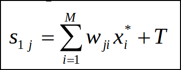

        или в матричной форме:

        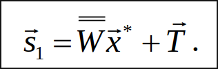

        Для расчета выходов нейронов первого слоя y1 к полученным значениям состояний применяется активационная функция (15.2).
