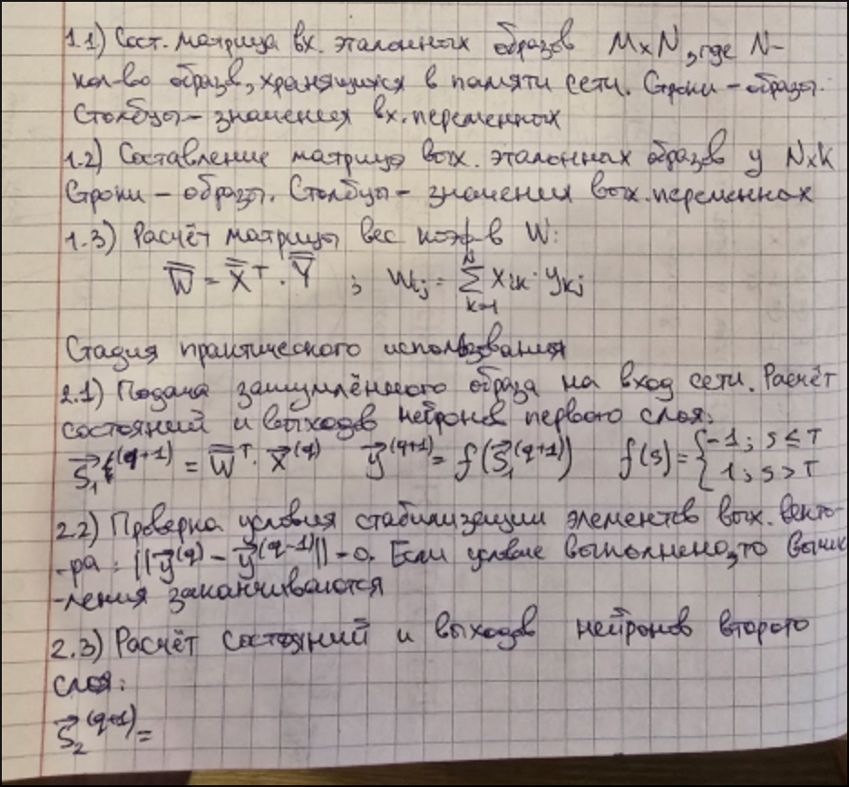

# Лекция 8

## Н.С. Коско 

Ограничения практического использования:

Количество ассоциаций, хранимых в памяти сети(N), не должно превышать 15% от наименьшего количества
нейронов среди слоев(K, M).

При большем количестве N должно соблюдаться следующее неравенство: 

Особенности реализации:

1. Можно задавать различные(негомогенная сеть) или одинаковые(гомогенная сеть) значения порога T
   активационной функции.

2. При решении задачи классификации каждый класс описывается вектором, содержащим значение 1 в
   уникальной позиции, соответствующей данному классу(более предпочтительный вариант), или вектором с
   уникальной комбинацией значений -1 или +1 (менее предпочтительный вариант).

---

## Н.С. Хемминга

Н.С. Хемминга - двухслойная НС, является рекуррентной, имеет обратные связи(для подачи выходных сигналов
второго слоя на входы второго слоя); бинарное кодирование входов; входы - признаки, по которым
различаются объекты; количество нейронов в обоих слоях соответствует количеству классов; выходы -
указатели на класс объекта.

Имеется набор эталонных образов, представленных бинарными векторами. Каждому образу соответствует свой
класс. Требуется поданный на вход обученной сети зашумленный образ сопоставить с известными эталонными
образами и сделать заключение:

* о соответствии одному из эталонов.
* о несоответствии ни одному из эталонов.
* о невозможности выбрать соответствие между несколькими вариантами эталонов.

---

## Пример

